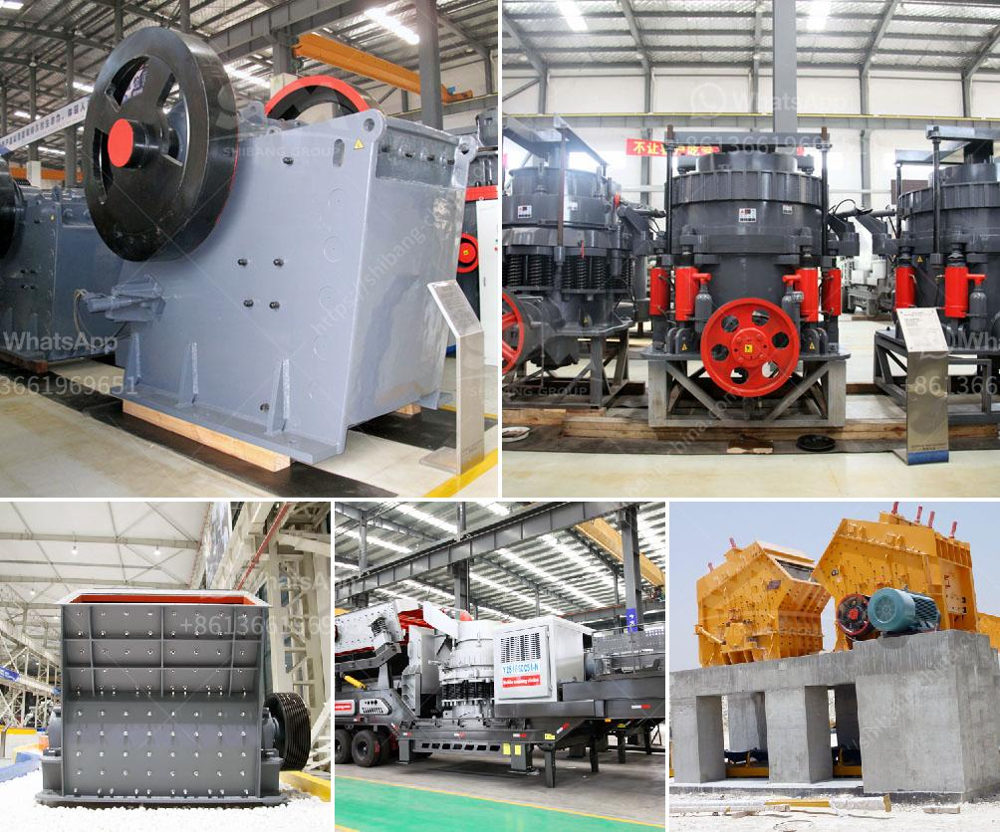

<h3>ball mill procedure in practical</h3>
The ball mill is an essential grinding equipment for concentrators. It is mainly used for grinding operations before sorting. It is equipped with grading equipment for grinding and grading to complete the sorting of minerals. It is widely used in cement, silicate products, and new building materials. , Refractory materials, chemical fertilizers, ferrous and non-ferrous metal beneficiation and glass ceramics and other production industries, dry or wet grinding various ores and other grindable materials.

The ball mill is composed of a horizontal cylinder, a hollow shaft for feeding and discharging materials, and a grinding head. Both ends of the cylinder are caps, and the inner wall of the cylinder is lined with abrasion-resistant liners, which are mostly made of manganese steel, chromium steel, rubber, or other materials. In order to ensure that the hollow axis has certain eccentricity and runs smoothly, the cylinder is equipped with a transmission device (gear transmission, synchronous motor drive and other elastic wheel transmission).

1. First, the operator needs to check the tightness and looseness of the various parts of the ball mill, such as the transmission device, the grinding body in the barrel, the lining plate in the compartment, etc., and whether the lubricating oil in the lubrication system is sufficient.

2. Before starting the ball mill, the material in the cylinder inlet and the empty space in the cylinder should be cleaned to ensure that there are no sundries and obstacles that affect the smooth startup of the equipment.

3. Start the ball mill motor, and adjust the speed to approximately 30%-40% of the rated speed of the ball mill. After the normal rotation, the operation can be started.

4. The feeding process of the ball mill: at the beginning of the feeding process, the operator needs to observe the size of the ore particles, and adjust the feed amount of the ball mill according to the size of the particles, and timely remove the steel balls that do not comply with the working requirements from the ball mill.

5. During the operation of the ball mill, the operator should pay attention to the size and quantity of steel balls. If the steel ball is running, the collision between the steel balls may cause changes in the ore feed rate or even block the discharge port, which will directly affect the operation of the ball mill.

6. During the operation of the ball mill, the operator should check the running condition of the ball mill regularly, and listen to the sound of the ball mill, such as the noise of the distribution gear, the scraping sound of the cylinder lining plate, etc. If an abnormality is found, the operation should be stopped immediately for inspection and treatment.

7. After the ball mill has been running for a period of time, the operator should check the temperature of the main bearing and the motor, and other parts that are prone to heat. If it exceeds the specified range, the lubrication work should be strengthened or the equipment should be shut down for inspection.

8. After the ball mill operation is completed, the equipment should be stopped according to the prescribed order and the motor can be turned off.

In summary, the ball mill procedure mentioned above is applicable in the practical operation of ball mills. It is essential to carry out regular maintenance and repair work to ensure the normal operation and high-efficiency production of the ball mill.
<h3>Contact us</h3><ul><li><strong>Whatsapp:&nbsp;<a href="https://wa.me/8613661969651">+8613661969651</a></strong></li><li><a href="https://swt.shibang-china.com/?git&amp;zhl&amp;ball mill procedure in practical"><strong>Online Service(chat now)</strong></a></li></ul><h3>Related</h3><ul><li><a href='quartz stone pulverizer.md'>quartz stone pulverizer</a></li><li><a href='mobile crusher line.md'>mobile crusher line</a></li><li><a href='marble quarry business plan.md'>marble quarry business plan</a></li><li><a href='quartz stone crushers materials.md'>quartz stone crushers materials</a></li><li><a href='quarry crusher business in south africa.md'>quarry crusher business in south africa</a></li></ul>