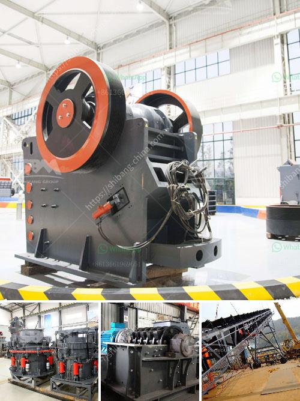

<h3>ball mill project</h3>
The launch of the ball mill project marks a major milestone for the development of the ore processing facility. The ball mill project is part of the broader Ichthys redevelopment project, which is set to increase the efficiency and lifespan of the existing infrastructure at the Ichthys operation.

The ball mill project was initiated by First Graphite Ltd, an Australian publicly listed company that produces high-quality graphene for use in a range of industries. The company recognized the potential for the project to significantly enhance the efficiency of their operations, as well as the overall profitability of the Ichthys operation.

The ball mill project involves the installation of a new ball mill, which will increase the grinding capacity of the current plant and provide additional power supply to meet the increasing demands of our operations. The new ball mill is expected to increase our throughput capacity from 350,000 to 900,000 tonnes per annum and produce a finer grind, which will enhance the recovery of precious metals from the ore.

The project is also expected to improve the overall energy efficiency of the operation, with the new ball mill using less energy per tonne of ore processed. This will not only reduce our carbon footprint but also contribute to cost savings and provide a more sustainable solution for our operations.

In addition to the installation of the new ball mill, the project also includes the construction of a new power supply infrastructure to support the increased production capacity. This will involve the installation of additional transformers, switchgear, and other electrical equipment to ensure a reliable and uninterrupted power supply to the ball mill.

The project team has been working diligently to ensure the successful completion of the ball mill project. Detailed engineering studies, as well as environmental and safety assessments, have been conducted to ensure that the project meets all regulatory requirements and industry best practices.

The ball mill project is expected to be completed within the next 12 months, with commissioning and full operation expected shortly after. The project will not only provide a significant boost to the overall efficiency of our operations but will also create additional employment opportunities for the local community.

Overall, the ball mill project is a significant investment by First Graphite Ltd, which demonstrates our commitment to the long-term sustainability of the Ichthys operation. The increased grinding capacity and improved energy efficiency will not only enhance our competitive position in the market but also contribute to the overall economic development of the region.

We are excited about the positive impact that the ball mill project will have on our operations and look forward to its successful completion. We would like to express our gratitude to all stakeholders, including our employees, contractors, shareholders, and the local community, for their support and contributions to the project.
<h3>Contact us</h3><ul><li><strong>Whatsapp:&nbsp;<a href="https://wa.me/8613661969651">+8613661969651</a></strong></li><li><a href="https://swt.shibang-china.com/?git&amp;zhl&amp;ball mill project"><strong>Online Service(chat now)</strong></a></li></ul><h3>Related</h3><ul><li><a href='aggregate washing plant cost.md'>aggregate washing plant cost</a></li><li><a href='rencana bisnis perusahaan tambang pdf.md'>rencana bisnis perusahaan tambang pdf</a></li><li><a href='manufacturer of ball mill india.md'>manufacturer of ball mill india</a></li><li><a href='stone crusher turkey.md'>stone crusher turkey</a></li><li><a href='benefits of vsi crusher.md'>benefits of vsi crusher</a></li></ul>