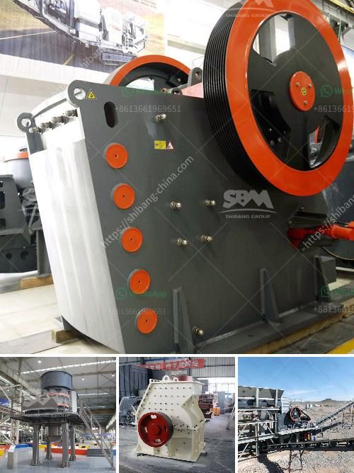

<h3>ball mill vibration limits</h3>
Ball mills are integral equipment in the mining industry, used to grind ores and other materials. The vibration associated with ball mill operation affects not only the mill itself but also the surrounding structures and the processed material. Mining and milling industries commonly utilize ball mills as a part of their comminution processes, which can cause various types of vibrations.

Vibrations in ball mills can be caused by the movement of steel balls, the rotating shell, and the material being ground. Excessive vibrations can lead to equipment damage and increased maintenance costs, resulting in a decrease in overall plant productivity. Thus, it is crucial to establish and adhere to acceptable vibration limits to ensure the mill operates within its optimal performance range.

Several factors contribute to the occurrence of vibrations in ball mills. One of the primary sources is an uneven distribution of material inside the mill, resulting in an unbalanced load. This imbalance can be caused by several factors, including variation in ore particle size, changes in ore feed rate, inadequate ball charge, and wear of mill liners. Additionally, misalignment of the gear units and the mill shell can also induce vibrations.

Vibration limits for ball mills are established based on the severity of the vibration experienced during normal operation. Some commonly used vibration severity standards include the ISO 10816, which classifies vibrations into different zones based on machine type and rotational speed. These standards provide guidelines on acceptable vibration levels to prevent excessive wear and failure of equipment.

Monitoring the vibrations of the mill in real-time is crucial to detect any abnormalities and take immediate action. Various techniques are used to measure and analyze vibrations, including accelerometers, displacement sensors, and vibration monitoring systems. By continuously monitoring the vibrations, plant operators can identify potential issues and make adjustments to prevent further damage.

To mitigate excessive vibrations, several strategies can be employed. Ensuring proper alignment of the mill components and regular maintenance of the gear units can help reduce vibrations caused by mechanical factors. Proper ball charge management and adjustment of mill speed can also help control vibrations induced by uneven material distribution. Additionally, using advanced control systems that incorporate real-time vibration monitoring can optimize mill operation and reduce vibrations.

However, it is essential to note that total elimination of vibrations is not always possible or necessary. A small amount of vibration is often inherent in machine operation and can be considered acceptable within specified limits. Striking the balance between operational efficiency and acceptable vibration levels is crucial to ensure optimal performance and avoid costly equipment failures.

In conclusion, ball mill vibrations can be detrimental to both the equipment and the material being processed. Establishing and adhering to acceptable vibration limits is essential to prevent equipment damage and minimize maintenance costs. Continuous monitoring of vibrations and implementation of appropriate mitigation strategies can help optimize mill operation and maintain productive mining processes.
<h3>Contact us</h3><ul><li><strong>Whatsapp:&nbsp;<a href="https://wa.me/8613661969651">+8613661969651</a></strong></li><li><a href="https://swt.shibang-china.com/?git&amp;zhl&amp;ball mill vibration limits"><strong>Online Service(chat now)</strong></a></li></ul><h3>Related</h3><ul><li><a href='coal washing process yotube.md'>coal washing process yotube</a></li><li><a href='complete stone crushing plant.md'>complete stone crushing plant</a></li><li><a href='mobile crusher in saudi arabia.md'>mobile crusher in saudi arabia</a></li><li><a href='concrete crusher price philippines.md'>concrete crusher price philippines</a></li><li><a href='used classifiers for sale from alpine.md'>used classifiers for sale from alpine</a></li></ul>