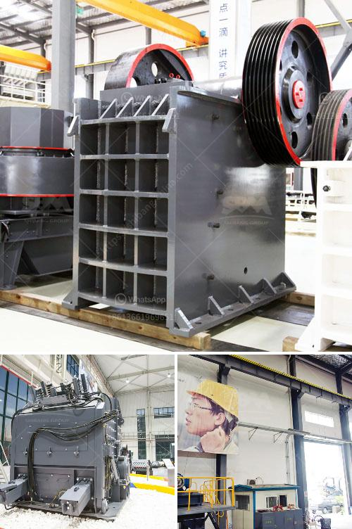

<h3>ball mill vs vertical roller mill pdf</h3>
Ball mill and vertical roller mill are two of the most commonly used equipment in cement grinding processes. Ball mill vs vertical roller mill pdf is an interesting issue, as both devices have their own advantages and disadvantages.

The ball mill has a very small particle size distribution, which is difficult to achieve with any other equipment. It can grind materials with particle sizes below 100 microns. The fineness of the finished product is controlled by the speed of rotation of the grinding chamber and the diameter and length of the ball mill. The productivity of the ball mill is high, and the energy consumption is low.

The ball mill also has many other advantages, such as the flexibility to grind various types of materials. With the same fineness of the finished product, the ball mill consumes up to 40% less energy than similar products. In addition, the ball mill has a simple structure and convenient operation and maintenance.

The vertical roller mill has a larger capacity and a higher grinding efficiency, which is suitable for large-scale industrial production. With the same fineness of the finished product, the vertical roller mill consumes less energy than the ball mill.

Vertical roller mill is also easier to detect and control the product particle size distribution and chemical composition, which reduces the quality fluctuation of the product. Vertical roller mill is a kind of drying and grinding equipment with large capacity and wide application.

In terms of fuselage structure, the two devices are very different. The vertical roller mill mainly consists of a grinding roller device, grinding disc device, hydraulic device, motor, reducer, separator, and so on.

The ball mill mainly consists of a feeding device, a rotating part, a driving part, a hollow shaft, a discharging device and a lubrication system.

In terms of grinding process, the two devices have their own characteristics. The vertical roller mill uses the material bed grinding principle to grind the material, and the ball mill uses the impact crushing principle to grind the material.

There is a certain difference in grinding efficiency between the two devices. In general, the grinding efficiency of the vertical roller mill is higher than that of the ball mill. However, the ball mill is easy to cause over-grinding and the efficiency is lower.

In terms of application range, the vertical roller mill is more suitable for fine grinding of materials, while the ball mill is more suitable for grinding coarse materials.

In conclusion, both the ball mill and vertical roller mill have their own advantages and disadvantages in the cement grinding process. Therefore, it is important to make a comprehensive analysis according to the actual production needs to select the most suitable grinding equipment.
<h3>Contact us</h3><ul><li><strong>Whatsapp:&nbsp;<a href="https://wa.me/8613661969651">+8613661969651</a></strong></li><li><a href="https://swt.shibang-china.com/?git&amp;zhl&amp;ball mill vs vertical roller mill pdf"><strong>Online Service(chat now)</strong></a></li></ul><h3>Related</h3><ul><li><a href='granite and marble factory for sale.md'>granite and marble factory for sale</a></li><li><a href='stone crusher dubai for sale.md'>stone crusher dubai for sale</a></li><li><a href='tracked mobile screening plant.md'>tracked mobile screening plant</a></li><li><a href='ball mill vibration limits.md'>ball mill vibration limits</a></li><li><a href='gold rock crusher plant portable.md'>gold rock crusher plant portable</a></li></ul>