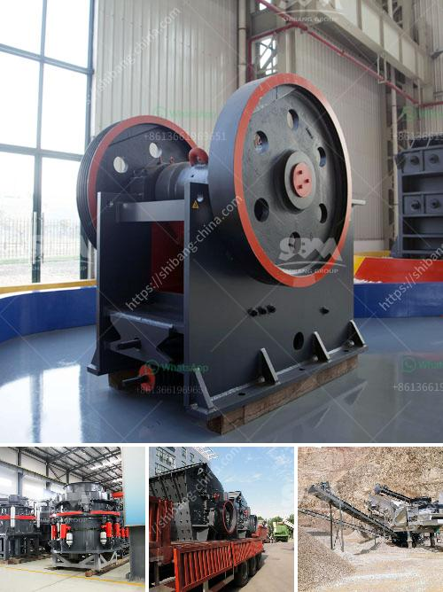

<h3>ball milling machines suppliers in egypt</h3>
Ball milling machines are indispensable pieces of equipment in the manufacturing industry. These machines have been around for centuries, but their role in the production process has evolved over time. In Egypt, there are numerous ball milling machine suppliers that provide high-quality machines to the local market and abroad. In this article, we will explore the ball milling machine suppliers in Egypt and highlight their key offerings.

One of the leading ball milling machine suppliers in Egypt is Promas Engineers. They offer a wide range of ball mills, including the batch type ball mill, continuous type ball mill, grid type ball mill, and overflow type ball mill. These machines are tested on various parameters to ensure their durability, efficiency, and reliability. The batch type ball mill is suitable for grinding and blending materials in small quantities, whereas the continuous type ball mill is designed for continuous grinding of large quantities of material.

Another prominent supplier in Egypt is Techzone. They specialize in providing high-quality ball milling machines that are designed for both wet and dry grinding applications. Their machines are highly versatile and can be used in various industries such as construction, chemicals, ceramics, and more. Techzone's ball milling machines are known for their robust construction, energy efficiency, and low maintenance requirements.

Next on the list is Arab Union for Cement and Building Materials (AUCBM), a reputable supplier in the Egyptian market. AUCBM offers a wide range of ball milling machines that are specifically designed for the cement industry. Their machines are capable of grinding raw materials, clinker, and additives to obtain the desired fineness. AUCBM's ball milling machines are engineered to meet the rigorous demands of the cement industry, ensuring high productivity and efficiency.

Egyptian International Company for Mining (EICM) is yet another reliable supplier of ball milling machines in Egypt. They focus on providing cutting-edge technologies and innovative solutions to their clients. EICM's ball milling machines are renowned for their precision, performance, and productivity. Their machines are suitable for various applications, including mineral processing, ceramics, and chemicals.

Last but not least, we have Arab Empire for Industrial Machinery (AEIM), a leading supplier of ball milling machines in Egypt. AEIM offers a diverse range of machines, including standard ball mills, planetary ball mills, and attritor mills. Their machines are designed to meet the varied needs of different industries. AEIM's ball milling machines are praised for their efficiency, reliability, and advanced features.

In conclusion, Egypt is home to several reputable ball milling machine suppliers that cater to the diverse needs of industries. Promas Engineers, Techzone, AUCBM, EICM, and AEIM are some of the renowned suppliers offering high-quality machines. Whether it is for grinding raw materials, additives, or minerals, these suppliers provide a wide range of ball milling machines that are known for their efficiency, durability, and high performance. With their cutting-edge technologies and innovative solutions, these suppliers continue to enhance the manufacturing processes of various industries in Egypt.
<h3>Contact us</h3><ul><li><strong>Whatsapp:&nbsp;<a href="https://wa.me/8613661969651">+8613661969651</a></strong></li><li><a href="https://swt.shibang-china.com/?git&amp;zhl&amp;ball milling machines suppliers in egypt"><strong>Online Service(chat now)</strong></a></li></ul><h3>Related</h3><ul><li><a href='raymond mill india.md'>raymond mill india</a></li><li><a href='river sand mining machine for sale.md'>river sand mining machine for sale</a></li><li><a href='high capacity fine stone quarry crusher machine.md'>high capacity fine stone quarry crusher machine</a></li><li><a href='komatsu crusher for sale in malaysia.md'>komatsu crusher for sale in malaysia</a></li><li><a href='grinding mill machines in south africa.md'>grinding mill machines in south africa</a></li></ul>