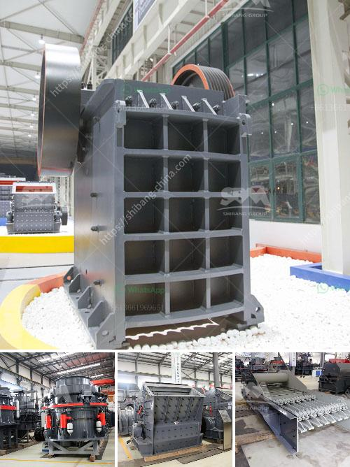

<h3>ball mills for clay</h3>
Ball mills are widely used in the production of ceramics, cement, paint, coatings, chemicals, and other industrial materials. They are ideal for grinding materials such as clay, ceramic materials, glazes, and pigments. They can grind wet or dry material, making them highly versatile machines suitable for a wide range of applications.

When it comes to clay, ball mills have several advantages over traditional milling equipment. Firstly, the raw material is powerful and sturdy, which makes it more resistant to wear and tear compared to other materials. Clay also requires a unique grinding process due to its high plasticity, making it more challenging to work with. Ball mills are designed to effectively grind clay particles into smaller particles, making it easier to mix with other ingredients and shape into the desired form.

The design of the ball mill ensures that the clay particles are ground to the optimum consistency, resulting in a smooth, uniform material. This is crucial for achieving a high-quality product, whether it's clay for pottery, ceramics, or other applications.

Furthermore, ball mills offer precise control over the grinding process, allowing for accurate particle size distribution and improved product quality. This is particularly important for clay, as different applications require specific particle sizes and properties.

In addition to their efficiency, ball mills for clay are relatively simple to operate and maintain. They have a straightforward design with few moving parts, making them reliable and easy to clean. This reduces downtime and ensures continuous production without significant interruptions.

Overall, ball mills are well-suited for clay grinding applications due to their efficiency, versatility, and low maintenance requirements. Whether used in ceramic production, pottery making, or any other clay-related process, these machines provide accurate and consistent results. With the right adjustments, they can produce various particle sizes and achieve the desired properties for any clay product.
<h3>Contact us</h3><ul><li><strong>Whatsapp:&nbsp;<a href="https://wa.me/8613661969651">+8613661969651</a></strong></li><li><a href="https://swt.shibang-china.com/?git&amp;zhl&amp;ball mills for clay"><strong>Online Service(chat now)</strong></a></li></ul><h3>Related</h3><ul><li><a href='crushing equipment for rent.md'>crushing equipment for rent</a></li><li><a href='to see vibrating screens.md'>to see vibrating screens</a></li><li><a href='desain conveyor belt di tambang batu bara.md'>desain conveyor belt di tambang batu bara</a></li><li><a href='impact crusher machine manufacturer.md'>impact crusher machine manufacturer</a></li><li><a href='vertical roller mill in cement plant.md'>vertical roller mill in cement plant</a></li></ul>