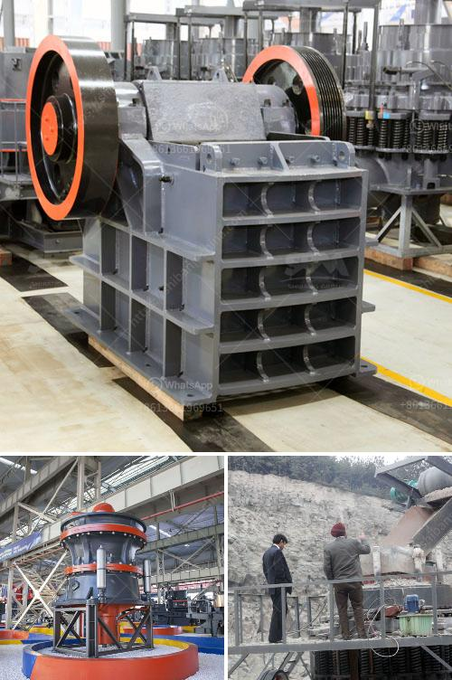

<h3>ball mills for sale</h3>
Ball mills are a fundamental part of many industrial and mining operations. They are used to grind materials into a fine powder, allowing for the reduction of the particle size of materials for subsequent processing.

A ball mill consists of a hollow cylindrical shell rotating about its axis. The axis of the shell may be either horizontal or at a small angle to the horizontal. It is partially filled with balls, usually made of steel or other durable materials, to grind the material to the desired fineness. The inner surface of the cylindrical shell is usually lined with an abrasion-resistant material such as manganese steel or rubber, to prevent wear and prolong the life of the mill.

Ball mills are used in various industries such as mining, cement, ceramics, and chemicals. They are commonly used in the grinding of materials such as ores, coal, limestone, and pigments. The grinding process is performed by using balls of different sizes, which collide and grind the material into a fine powder.

One advantage of ball mills is their versatility. They can be used for both wet and dry grinding, making them suitable for a wide range of applications. Another advantage is the relatively simple design of ball mills, which allows for ease of operation and maintenance.

There are various types of ball mills available in the market, ranging from laboratory scale to large industrial-sized mills. When considering ball mills for sale, it is important to choose a reputable and reliable supplier. The supplier should have a proven track record of providing high-quality equipment and excellent customer service.

In conclusion, ball mills are versatile and essential equipment in a variety of industries. They are used for grinding materials into a fine powder, with applications ranging from mining to pharmaceuticals. When looking for ball mills for sale, it is crucial to choose a trusted supplier to ensure the quality and longevity of the equipment.
<h3>Contact us</h3><ul><li><strong>Whatsapp:&nbsp;<a href="https://wa.me/8613661969651">+8613661969651</a></strong></li><li><a href="https://swt.shibang-china.com/?git&amp;zhl&amp;ball mills for sale"><strong>Online Service(chat now)</strong></a></li></ul><h3>Related</h3><ul><li><a href='conveyor belt suppliers in lusaka.md'>conveyor belt suppliers in lusaka</a></li><li><a href='vertical roller mill in cement plant.md'>vertical roller mill in cement plant</a></li><li><a href='sand washing equipment.md'>sand washing equipment</a></li><li><a href='crusher manufacturers in malaysia.md'>crusher manufacturers in malaysia</a></li><li><a href='stone quarry companies in ghana.md'>stone quarry companies in ghana</a></li></ul>