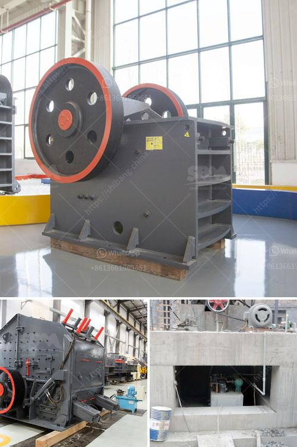

<h3>ball mills in autocad</h3>
Ball mills are a common grinding tool in the mineral processing industry, mainly used to grind various hardness of raw ore. They are widely used in the beneficiation process, such as wet grinding, dry grinding, open or closed circuit grinding, and grid type and overflow type grinding. With the continuous development of science and technology, ball mills have also been transformed into high-efficiency and energy-saving equipment. AutoCAD, a drafting and design software, plays a vital role in the design and modeling of ball mills.

AutoCAD is a powerful computer-aided design tool that is widely used in various industries, including mechanical engineering, architecture, and manufacturing. It allows engineers and designers to create 2D and 3D models with precise measurements and dimensions.

In the field of ball mill design, AutoCAD drawings can be used as a basic blueprint for the construction of a complete production line. With the help of AutoCAD, ball mill components such as liners, grinding media, and other equipment can be accurately modeled and analyzed. This allows engineers to optimize the design, improve the efficiency, and reduce the operating costs of ball mills.

One of the key advantages of using AutoCAD in ball mill design is the ability to instantly modify and update the design. Engineers can easily make changes to the model, such as adjusting the size or shape of the mill, changing the configuration of the liners, or modifying other components. AutoCAD's parametric design capabilities allow for the quick and efficient adjustment of design parameters and dimensions, saving valuable time and resources.

Furthermore, AutoCAD allows for the simulation and analysis of ball mill performance. By applying finite element analysis (FEA) techniques, engineers can evaluate the structural integrity, stress distribution, and performance characteristics of the ball mill. This information can then be used to optimize the design, ensuring the mill operates efficiently and reliably.

In addition to design and analysis, AutoCAD can also be used to create detailed technical drawings and documentation for manufacturing and installation purposes. These drawings provide precise instructions for the fabrication of the ball mill, ensuring that all components are manufactured to the required specifications. Moreover, AutoCAD can generate parts lists and assembly instructions, simplifying the manufacturing process.

In conclusion, AutoCAD is an indispensable tool in the design and modeling of ball mills. Its powerful features enable engineers to create accurate 2D and 3D models, optimize design parameters, and analyze performance characteristics. Furthermore, AutoCAD streamlines the manufacturing process by generating detailed technical drawings and documentation. With the use of AutoCAD, ball mills can be designed and manufactured with improved efficiency, reliability, and cost-effectiveness.
<h3>Contact us</h3><ul><li><strong>Whatsapp:&nbsp;<a href="https://wa.me/8613661969651">+8613661969651</a></strong></li><li><a href="https://swt.shibang-china.com/?git&amp;zhl&amp;ball mills in autocad"><strong>Online Service(chat now)</strong></a></li></ul><h3>Related</h3><ul><li><a href='feldspar grinding plant.md'>feldspar grinding plant</a></li><li><a href='mobile crusher sale germany.md'>mobile crusher sale germany</a></li><li><a href='from lead ore saparated gold and silver plant.md'>from lead ore saparated gold and silver plant</a></li><li><a href='project cost of mini cement plant in india.md'>project cost of mini cement plant in india</a></li><li><a href='beneficiation small scale tin ore processing plant.md'>beneficiation small scale tin ore processing plant</a></li></ul>