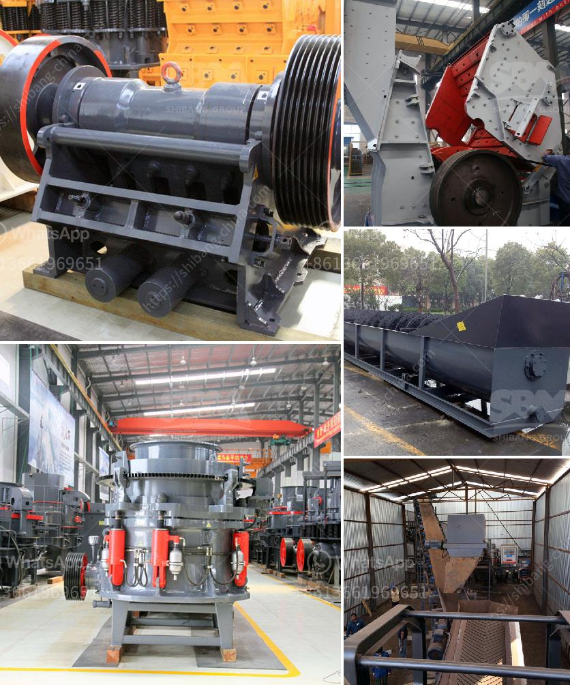

<h3>ball mills in solidwork</h3>
Ball mills are a common type of grinding mill used in many industries to grind materials into fine powder. Due to the high rotational speed of these mills, the grinding balls inside them are subjected to enormous amounts of force. This results in the materials being ground down into smaller particles.

One popular software used for designing ball mills is SolidWorks. SolidWorks is a computer-aided design (CAD) and computer-aided engineering (CAE) software that allows engineers and designers to create and simulate three-dimensional (3D) models.

Using SolidWorks, engineers can design various parts of a ball mill like the shell, head, trunnion, and liners. These parts can then be easily assembled and simulated to assess their performance. Designing in 3D provides a more realistic representation of the ball mill, allowing engineers to identify any design or assembly issues before manufacturing.

In SolidWorks, engineers can apply different materials and properties to the ball mill components. This ensures that the simulation accurately predicts how the ball mill will behave under various conditions. For example, engineers can simulate the impact of different grinding media (e.g., steel balls vs. ceramic balls) on the grinding process.

SolidWorks also allows engineers to study the flow of materials inside the ball mill. By creating a computational fluid dynamics (CFD) model, engineers can visualize how the materials are distributed within the mill. This information helps in optimizing the mill design, improving the efficiency of the grinding process, and minimizing energy consumption.

Another advantage of using SolidWorks for designing ball mills is the ability to perform finite element analysis (FEA). FEA allows engineers to verify the structural integrity of the mill components under different loadings. By analyzing the stress and deformation, engineers can determine if any modifications are needed to ensure the longevity and safety of the mill.

Additionally, SolidWorks provides tools for dynamic simulation, which can be used to model the motion of the grinding media inside the mill. This allows engineers to study the impact and friction between the grinding balls and the material being ground. By understanding these interactions, engineers can optimize the size and shape of the grinding media to achieve the desired grinding efficiency.

In conclusion, SolidWorks is a powerful tool for designing and simulating ball mills. It enables engineers to create accurate 3D models, analyze the flow and distribution of materials, perform finite element analysis, and simulate the dynamic behavior of the mill. By leveraging these capabilities, engineers can improve the design and performance of ball mills, leading to more efficient grinding processes in various industries.
<h3>Contact us</h3><ul><li><strong>Whatsapp:&nbsp;<a href="https://wa.me/8613661969651">+8613661969651</a></strong></li><li><a href="https://swt.shibang-china.com/?git&amp;zhl&amp;ball mills in solidwork"><strong>Online Service(chat now)</strong></a></li></ul><h3>Related</h3><ul><li><a href='feldspar crusher price.md'>feldspar crusher price</a></li><li><a href='mobile crusher plant price in india.md'>mobile crusher plant price in india</a></li><li><a href='stone paper production machine.md'>stone paper production machine</a></li><li><a href='used ball milling machine for sale canada.md'>used ball milling machine for sale canada</a></li><li><a href='ash grinding machine.md'>ash grinding machine</a></li></ul>