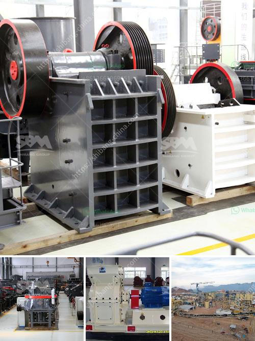

<h3>ball mills sizes</h3>
Ball mills are mechanical devices that grind materials into fine powders, which are essential in many industrial sectors. They are commonly used in the mining and construction industries to grind minerals, cement, and other raw materials. The size of a ball mill plays a crucial role in its performance and efficiency.

Different ball mill sizes have different capacities and power requirements. Small-sized ball mills are ideal for laboratory settings, where experimental work is conducted on a small scale. These ball mills typically have a diameter of around 1-2 meters and can hold up to a few liters of material. They are used for grinding and mixing small amounts of materials, making them suitable for research purposes.

On the other hand, large-sized ball mills are used in industrial settings, where large amounts of material need to be ground or pulverized. These ball mills are typically several meters in diameter and can hold up to hundreds of cubic meters of material. They can process thousands of tons of raw material per day, making them crucial in industries like mining and cement production.

The efficiency of a ball mill is affected by its size. Larger ball mills tend to have a higher grinding efficiency due to their increased capacity. However, they also require more power to operate, which can make them more expensive to run. Smaller ball mills are more energy-efficient but can only process limited amounts of material at a time.

When selecting a ball mill size, several factors should be considered. These include the type of material being processed, the desired fineness of the final product, the required production capacity, and the available power supply. It is crucial to choose a ball mill size that is best suited for the specific application to ensure optimal performance and cost-effectiveness.

In conclusion, ball mills come in various sizes, ranging from small laboratory units to large industrial mills. The size of a ball mill is an important factor to consider when selecting the right equipment for a specific application. Smaller mills are more energy-efficient but have limited capacity, while larger mills can process more material but require more power. Careful consideration of these factors will ensure the optimal performance and cost-effectiveness of the ball mill.
<h3>Contact us</h3><ul><li><strong>Whatsapp:&nbsp;<a href="https://wa.me/8613661969651">+8613661969651</a></strong></li><li><a href="https://swt.shibang-china.com/?git&amp;zhl&amp;ball mills sizes"><strong>Online Service(chat now)</strong></a></li></ul><h3>Related</h3><ul><li><a href='mobile quarry crusher euipment.md'>mobile quarry crusher euipment</a></li><li><a href='crusher jaw crusher 6x8 jaw.md'>crusher jaw crusher 6x8 jaw</a></li><li><a href='coal conveyor supplier from india.md'>coal conveyor supplier from india</a></li><li><a href='crusher china jaw crusher cost.md'>crusher china jaw crusher cost</a></li><li><a href='small rock crusher machine for sale.md'>small rock crusher machine for sale</a></li></ul>