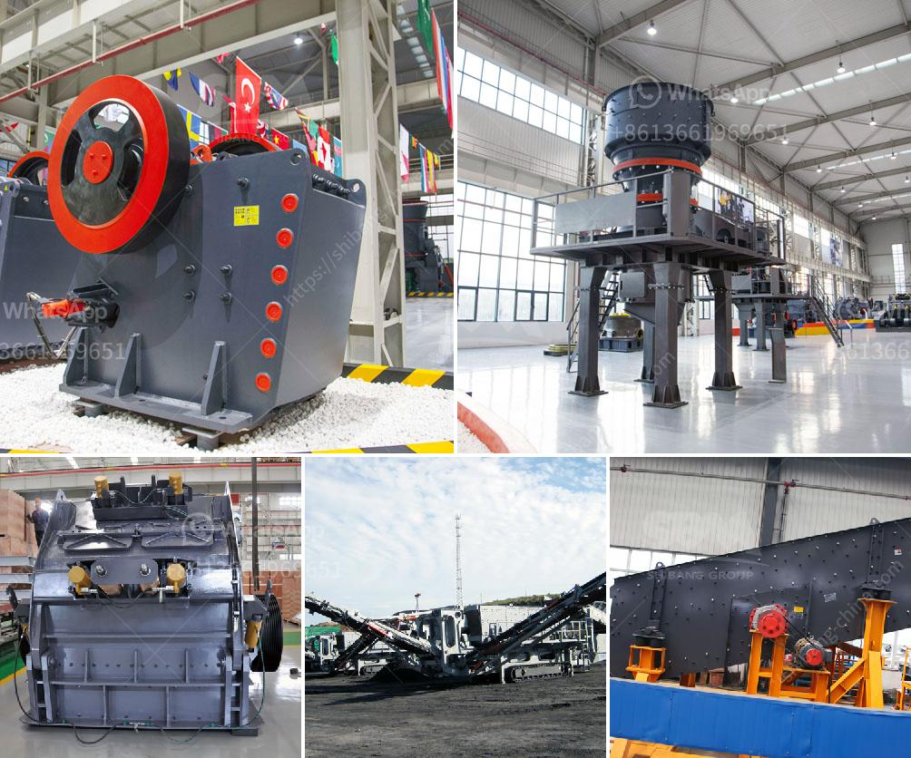

<h3>ballast crusher machine prices in kenya</h3>
Ballast is the stones or sand that is added to the railway tracks to enhance its stability as well as provide drainage. A good quality ballast is essential for the effective functioning of the railway tracks. The ballast crusher machine plays an important role in the whole production line.

It is widely used in railway construction and provides high-quality ballast materials for railroad construction. This equipment crushes stones into small-sized pieces. A typical crushing line for asphalt grade ballast consists of crushers, feeders, and screens for the ultimate product quality.

There are several types of ballast crushers used in ballast crushing and screening plant. These include jaw crusher, cone crusher, and impact crusher. Jaw crusher is used for coarse crushing to break large stones into small pieces which are then passed through the conveyor belt to the impact crusher for secondary crushing. The finely crushed stones are screened by the vibrating screen.

The price of different types of ballast crusher machines in Kenya is subject to varied selection and output requirements. The following is the brief introduction of some ballast crushers sold in Kenya.

Jaw crusher is a commonly used coarse crushing equipment. The output size range is 10-350mm, and the feed size range is 125-1200mm. It is used in the first process of crushing various minerals and rocks. It can process all kinds of ores with compressive strength not higher than 320 MPa to medium size at one time. It often forms a whole set of sand and stone production line together with cone crusher, counterattack crusher and other equipment.

Impact crusher is used for medium and fine crushing of materials with high hardness and brittle properties. It can crush materials with compressive strength of up to 350 MPa. The finished products are cubic in shape, with high bulk density and low iron pollution. The types of material crushed by impact crushers include limestone, granite, basalt, river pebble, cement clinker, quartz stone, iron ore, and bauxite.

Cone crusher is used for medium and fine crushing, which highly improves the utilization rate of materials. It has the features of large crushing ratio, high efficiency, low energy consumption, and uniform particle size. Its discharge port is adjustable and easy to control. The crushed product has a relatively uniform particle size and is widely used in a variety of industries.

The above machines are all essential machines in the ballast crusher plant. With the increasing demand for ballast, various manufacturers have launched a series of crushing equipment to meet various needs. Customers can choose the appropriate equipment according to their needs and budget.

In conclusion, ballast crusher machine prices in Kenya are diverse. Due to the different types, sizes, and parameters of various machines, the prices can be quite different. In addition, there are many factors affecting the price. Users are advised to choose a suitable ballast crusher machine model according to their own needs and the production status of the whole gravel production line.
<h3>Contact us</h3><ul><li><strong>Whatsapp:&nbsp;<a href="https://wa.me/8613661969651">+8613661969651</a></strong></li><li><a href="https://swt.shibang-china.com/?git&amp;zhl&amp;ballast crusher machine prices in kenya"><strong>Online Service(chat now)</strong></a></li></ul><h3>Related</h3><ul><li><a href='marble mining equipments.md'>marble mining equipments</a></li><li><a href='price of stone crusher size.md'>price of stone crusher size</a></li><li><a href='rudra industries ball mill manufacturers.md'>rudra industries ball mill manufacturers</a></li><li><a href='small scale gold process pictures.md'>small scale gold process pictures</a></li><li><a href='silica sand refind machines in germany.md'>silica sand refind machines in germany</a></li></ul>