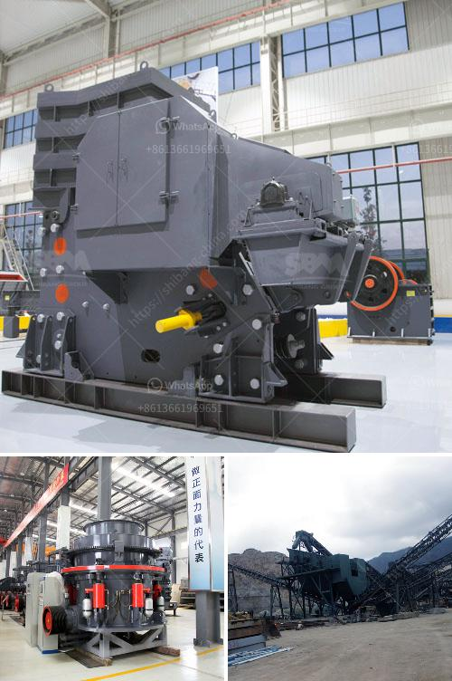

<h3>ballast crusher machine</h3>
Ballast is a crucial element in the construction and maintenance of railway tracks. To ensure that tracks are properly supported and drainage is maintained, ballast crushers are an essential piece of equipment in the rail industry.

Ballast crushing machines, manufactured in-house, are internationally renowned for producing high-quality aggregates for railway applications. Our machines cater to a wide range of track ballast crushing requirements, from small individual crushers to large-scale, high-capacity crushing plants.

The primary purpose of ballast crushing machines is to break down stones into small pieces. These machines then filter out the stones, ensuring the final product is suitable for laying on the track beds. Our ballast crushing machines achieve a fine comminution, which ensures a smooth and stable track bed that prevents structural damage to trains, railway infrastructure, and surrounding buildings.

Our machines are engineered to produce uniform-sized, high-quality aggregates that conform to railway track specifications. With various models available, we can cater to individual customer requirements, such as output capacity and the size of the final product. Additionally, our machines are built with durability in mind, ensuring consistent performance even in harsh working conditions.

Furthermore, our ballast crushing machines are easy to operate and maintain. Designed with safety as a priority, they offer user-friendly interfaces and are equipped with advanced automation features. This ensures efficient and trouble-free operation, minimizing downtime and maximizing productivity.

In conclusion, ballast crushing machines play a vital role in the construction and maintenance of railway tracks. With their ability to produce high-quality aggregates, they contribute to a safe and efficient railway network. Additionally, their user-friendly operation and durability make them a valuable asset to any rail project. Whether it's a small-scale operation or a large-scale infrastructure project, our ballast crushing machines are the ideal choice for reliable and cost-effective track ballast production.
<h3>Contact us</h3><ul><li><strong>Whatsapp:&nbsp;<a href="https://wa.me/8613661969651">+8613661969651</a></strong></li><li><a href="https://swt.shibang-china.com/?git&amp;zhl&amp;ballast crusher machine"><strong>Online Service(chat now)</strong></a></li></ul><h3>Related</h3><ul><li><a href='maintenance of raymond mill.md'>maintenance of raymond mill</a></li><li><a href='rock crusher and screens philippines.md'>rock crusher and screens philippines</a></li><li><a href='mobile crusher ghana.md'>mobile crusher ghana</a></li><li><a href='ball mills in solidwork.md'>ball mills in solidwork</a></li><li><a href='gypsum powder production process.md'>gypsum powder production process</a></li></ul>