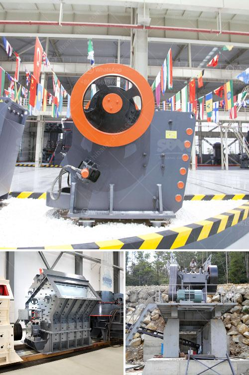

<h3>ballast crushing equipment</h3>
Ballast is a common requirement for railway tracks, creating a stable base for trains to easily glide over. As the world’s population continues to grow, so does the demand for transportation infrastructure. With millions of people commuting every day, the necessity for ballast is ever-increasing.

To fulfill this demand, crushing equipment plays a vital role. The process of crushing ballast involves the application of hydraulic pressure to break down the rock, resulting in finely crushed stones that serve as a sturdy foundation. This enables trains to travel smoothly, reducing the risk of accidents and ensuring efficient transportation.

Ballast crushing equipment is readily available and accessible across various regions. Allowing for efficient utilization and distribution, it can be easily transported from one location to another. This convenience makes it a cost-effective solution, as it eliminates the need for additional resources and labor.

The design of ballast crushing equipment has undergone significant advancements in recent years, incorporating modern features to enhance efficiency, durability, and safety. Equipped with automated systems, it reduces human error and increases productivity. Cutting-edge technologies ensure precise control over the crushing process, producing consistent quality and size.

Furthermore, ballast crushing equipment is designed to be environmentally friendly. It generates minimal noise and vibration, reducing disturbances to nearby communities and wildlife habitats. Additionally, it consumes less power, optimizing energy conservation. This commitment to eco-friendliness aligns with global efforts to reduce carbon emissions and mitigate environmental impact.

In conclusion, ballast crushing equipment is an essential tool in maintaining railway infrastructure. Its efficient crushing process ensures the creation of high-quality ballast, enabling a safe and efficient transportation system. With continued technological advancements, this equipment is poised to meet the growing demand for ballast and support sustainable development in the transportation sector.
<h3>Contact us</h3><ul><li><strong>Whatsapp:&nbsp;<a href="https://wa.me/8613661969651">+8613661969651</a></strong></li><li><a href="https://swt.shibang-china.com/?git&amp;zhl&amp;ballast crushing equipment"><strong>Online Service(chat now)</strong></a></li></ul><h3>Related</h3><ul><li><a href='grinding machine in greece.md'>grinding machine in greece</a></li><li><a href='cone crusher second hand for sale in south africa.md'>cone crusher second hand for sale in south africa</a></li><li><a href='concrete crusher for rent in toronto.md'>concrete crusher for rent in toronto</a></li><li><a href='jaw crushing plant.md'>jaw crushing plant</a></li><li><a href='crusher equipment supplier.md'>crusher equipment supplier</a></li></ul>