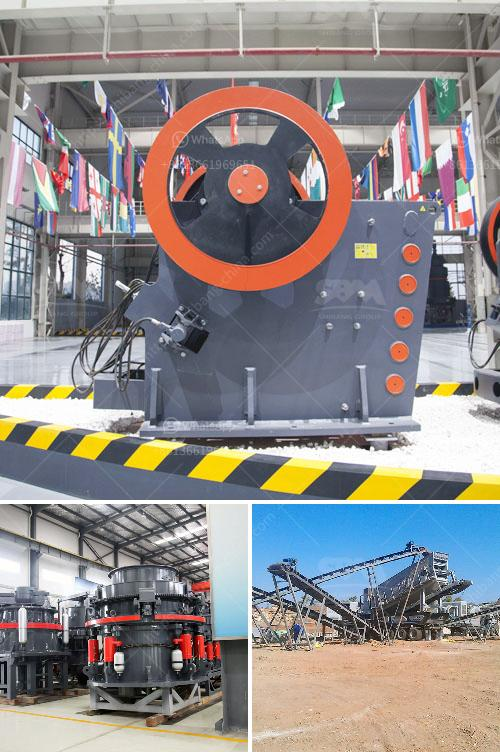

<h3>ballast ore crusher for sale in kenya</h3>
Ballast is the stones or sand that on the railway, provide a foundation for the tacks as well as the sleepers. It is widely used in road construction and maintenance, including construction of highways, bridges, tunnels, airports, etc. The ballast ore crusher plays a vital role in the crushing process of ballast ore processing plant.

As one of the leading manufacturers and suppliers of ballast ore crusher for sale in Kenya, we have the best ballast crusher for sale. Many businesses in Kenya have been started with the main objective of producing quality ballast as construction materials. Our main products include jaw crusher, cone crusher, impact crusher, hammer crusher, VSI crusher, ball mill, Raymond mill, grinding mill, vibrating screen, vibrating feeder, belt conveyor, etc.

With more than 30 years of experience in aggregate production, we have developed various crushing equipment to meet different customer requirements. Our ballast ore crusher is easy to operate and has low maintenance costs. It can crush stones into 5-20mm, 20-40mm, 40-70mm, 70-120mm, and various other sizes, which can be used in various construction projects.

The ballast ore crusher for sale plays a crucial role in the construction industry and provides high-quality ballast for the railway construction. This particular process requires a combination of jaw crusher and impact crusher. The mined stones are transported to the crusher site by trailors or truck and unloaded & stocked at ground level near the crusher. Big-sized stones are transferred to primary crusher through vibrating feeder from hopper for first crushing. Then the crushed materials are transferred to impact crusher through belt conveyor for secondary crushing. The materials are crushed again in the impact crusher and then sieved by vibrating screen. Different grades of materials can be obtained by the sieving process.

The ballast ore crusher in Kenya represents a guaranteed, state-of-the-art commitment to crushing know-how and quality. We have installed thousands of crushers worldwide with a track record of reliability and high productivity. Our experienced professionals are ready to assist you with the designing of the ballast ore crushing plant and provide all necessary equipment. Our ballast production line for sale is also available with quarry machine, extraction plant, crushing machine, grinding mill, screening plant, separation equipment, classifier, processing plant etc.

If you are interested, please feel free to contact us. We will provide you with the best products and the most sincere services to make you satisfied. With our extensive experience, we can offer an unmatched level of expertise in crushing solutions. No matter what your stone crushing needs are, we will provide you with a reasonable ballast crusher price and high-quality machine.
<h3>Contact us</h3><ul><li><strong>Whatsapp:&nbsp;<a href="https://wa.me/8613661969651">+8613661969651</a></strong></li><li><a href="https://swt.shibang-china.com/?git&amp;zhl&amp;ballast ore crusher for sale in kenya"><strong>Online Service(chat now)</strong></a></li></ul><h3>Related</h3><ul><li><a href='crusher in coal mining.md'>crusher in coal mining</a></li><li><a href='dicalcium phosphate process hydrochloric acid flow chart.md'>dicalcium phosphate process hydrochloric acid flow chart</a></li><li><a href='machinery for magnesium extracted from dolomite.md'>machinery for magnesium extracted from dolomite</a></li><li><a href='concrete crusher price philippines.md'>concrete crusher price philippines</a></li><li><a href='vibrating screen design products from philippines.md'>vibrating screen design products from philippines</a></li></ul>