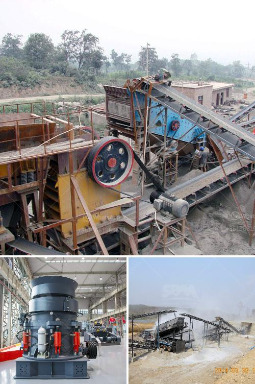

<h3>ballast quarry equipment supplies</h3>
Railway tracks are one of the most crucial components of any transportation network. They provide a stable and safe platform for trains, ensuring smooth and efficient travel. However, behind the scenes, there are several elements that contribute to the construction and maintenance of these tracks, one of which is ballast.

Ballast serves as a foundation for railway tracks, providing stability, better load distribution, and drainage. It is typically made up of crushed stones, which are carefully selected and arranged to maintain track alignment and integrity. To obtain high-quality ballast, specialized equipment and supplies are required from reputable manufacturers and suppliers.

One important equipment used in ballast quarrying is crushers. These powerful machines break down large rocks into smaller sizes, making them suitable for ballast production. Crushers come in various types, such as jaw crushers, impact crushers, and cone crushers, each designed with a specific purpose. They efficiently reduce the size of stones while ensuring minimal dust generation and maximum output.

Furthermore, screening equipment is essential in the ballast production process. It classifies the crushed stones into different sizes, ensuring uniformity and consistency. Vibratory screens or trommel screens are commonly used to achieve this task. These screens efficiently separate the stones based on their size, allowing the right combination for ballast construction.

Additionally, conveyor systems play a crucial role in transporting ballast from the quarry to the construction site. They not only save time and labor but also provide a safe and efficient means of transferring bulk materials. Conveyor belts, augers, and bucket elevators are commonly utilized to move the ballast with ease, enhancing productivity.

Choosing the right ballast quarry equipment and supplies is of utmost importance to ensure the quality and safety of railway tracks. Reputable suppliers offer machinery that meets industry standards, such as durability, efficiency, and environmental considerations. They provide equipment with advanced features, such as dust suppression systems, noise reduction mechanisms, and energy-saving capabilities.

Furthermore, the quality of ballast is highly influenced by the source and selection of stones. Reputable suppliers ensure that the stones used are hard, durable, and resistant to weathering. They conduct rigorous quality control measures to guarantee uniformity and consistency, meeting the specifications required by railway authorities.

In terms of safety, suppliers of ballast quarry equipment prioritize the well-being of their customers. They provide training and guidance on safe usage, handling, and maintenance of the equipment. Regular inspections and servicing are encouraged to detect any potential faults or issues that may arise during operation. By adhering to safety regulations, accidents can be minimized, creating a safer working environment for everyone involved.

To conclude, ballast quarry equipment supplies are critical in maintaining the quality and safety of railway tracks. The combination of crushers, screening equipment, and conveyor systems ensures the efficient production and transportation of ballast. Reputable suppliers play a crucial role in providing high-quality equipment that meets industry standards and promotes safety. By investing in reliable equipment and following stringent quality control measures, railway authorities can ensure the longevity and integrity of their tracks for safe and smooth train journeys.
<h3>Contact us</h3><ul><li><strong>Whatsapp:&nbsp;<a href="https://wa.me/8613661969651">+8613661969651</a></strong></li><li><a href="https://swt.shibang-china.com/?git&amp;zhl&amp;ballast quarry equipment supplies"><strong>Online Service(chat now)</strong></a></li></ul><h3>Related</h3><ul><li><a href='stone crushing machine manufacturers.md'>stone crushing machine manufacturers</a></li><li><a href='stone crusher supplier.md'>stone crusher supplier</a></li><li><a href='gold mining price.md'>gold mining price</a></li><li><a href='roller raymond mill with best price.md'>roller raymond mill with best price</a></li><li><a href='mobile crusher line.md'>mobile crusher line</a></li></ul>