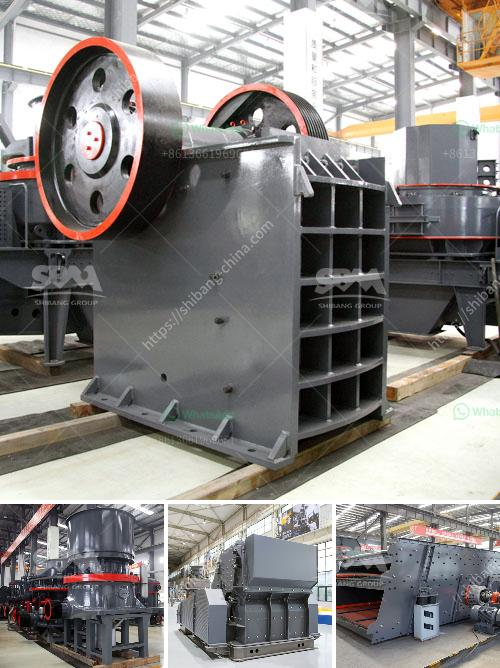

<h3>barite crusher machinery</h3>
Barite is a mineral composed of barium sulfate (BaSO4). It receives its name from the Greek word "barys" which means "heavy." This name is in response to barite's high specific gravity of 4.5, which is exceptional for a nonmetallic mineral. The high specific gravity of barite makes it suitable for a wide range of industrial applications, including the drilling mud in the petroleum industry, the manufacture of barium chemicals, and the cement industry.

To extract the barite from the earth, various types of mining equipment are employed. The choice of equipment depends on the desired characteristics of the final product, as well as the environmental and economic considerations. One crucial piece of equipment in the barite mining industry is the barite crusher machinery. The barite crusher machinery plays an important role in the barite grinding process.

Barite is a non-metallic mineral with a Mohs hardness of about 3-3.5. The main component of barite is barium sulfate (BaSO4). It is an important industrial raw material for the production of barium and barium compounds. Faced with the increasing demand for barite products, the industry's requirements for barite crusher machinery are also increasing. In recent years, many barite mines have seen this as an opportunity to improve their own production efficiency and use advanced barite crusher machinery.

There are various types of barite crusher machinery available in the market. Jaw crushers and impact crushers are commonly used machinery for primary crushing. Cone crushers and impact crushers are mainly used for secondary or tertiary crushing. Barite crusher machinery is widely used in barite crushing plants, such as barite jaw crusher, barite impact crusher, and barite cone crusher, and other auxiliary equipment like barite vibrating feeder, barite vibrating screen, and belt conveyor.

After crushing the barite, the final product size can be further processed by barite grinding mill machinery. The size of the finished product can be adjusted between 325-2500 mesh. The barite mill machinery can process barite into powder material suitable for various industrial applications. The fineness of the barite powder is uniform, and it is not easy to agglomerate.

Barite crusher machinery also plays an important role in the barite crushing process. Barite jaw crusher is used to crush the bulk barite into proper sizes to enter the grinding mill. Barite vibrating feeder evenly sends the crushed barite into the grinding chamber of the barite grinding mill. The barite grinding machine grinds the barite into fine powder which is collected by cyclone collector. The collected powder is discharged through the discharge valve to complete the grinding process.

In conclusion, barite crusher machinery is indispensable equipment in the barite crusher industry. The quality and performance of barite crusher machinery directly affect the efficiency and production capacity of barite processing plants. Therefore, barite investors should select high-quality barite crusher machinery and invest in suitable equipment to maximize their return on investment.
<h3>Contact us</h3><ul><li><strong>Whatsapp:&nbsp;<a href="https://wa.me/8613661969651">+8613661969651</a></strong></li><li><a href="https://swt.shibang-china.com/?git&amp;zhl&amp;barite crusher machinery"><strong>Online Service(chat now)</strong></a></li></ul><h3>Related</h3><ul><li><a href='small concrete crusher used.md'>small concrete crusher used</a></li><li><a href='vertical mill mining.md'>vertical mill mining</a></li><li><a href='granite gypsum quarry.md'>granite gypsum quarry</a></li><li><a href='stone crusher plants.md'>stone crusher plants</a></li><li><a href='how to calculate coal mill capacity for cement plant.md'>how to calculate coal mill capacity for cement plant</a></li></ul>