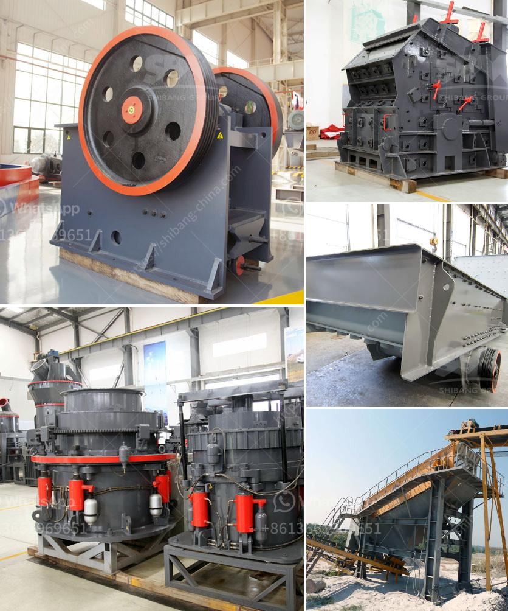

<h3>barite crushing machine from germany</h3>
Barite is a mineral found in natural deposits all over the world. It can be found in various colors, including yellow, brown, white, blue, and gray. In its purest form, barite is a crystalline compound known as barium sulfate (BaSO4). Due to its high specific gravity, barite is often used in various industries, including oil and gas drilling, as a drilling fluid additive.

The process of extracting barite starts with the mining of crude ore, which is then processed in a crushing machine. This machine crushes the barite chunks into smaller pieces, making it easier to transport and store. Once crushed, the barite is sieved to separate it into different size fractions, which are then used in various applications.

Germany is well-known for its advanced machinery and engineering, which makes it a reliable source for barite crushing machines. However, the barite crushing machine from Germany is distinguished by its powerful crushing force, high efficiency, and fine crushing effect. With innovative designs and reliable performance, the German barite crusher plant has been widely applied in mining, metallurgy, construction, chemical and other industries.

Barite Crushing Machine from Germany features a unique combination of heavy-duty rotor, wear material, and crushing chamber design. This combination has proved revolutionary in improving capacity, product quality, and reducing operating and wear costs. The machine's unique design ensures continuous and efficient crushing even with constant changes in feed material characteristics.

In conclusion, the barite crushing machine from Germany offers a wide range of benefits to industries around the world. The machine not only enhances productivity and efficiency but also contributes to environmental sustainability. Furthermore, its advanced features guarantee long-term reliability and performance, making it a cost-effective solution for barite processing. For any company in need of a reliable barite crushing machine, the German technology is undoubtedly a valuable investment.
<h3>Contact us</h3><ul><li><strong>Whatsapp:&nbsp;<a href="https://wa.me/8613661969651">+8613661969651</a></strong></li><li><a href="https://swt.shibang-china.com/?git&amp;zhl&amp;barite crushing machine from germany"><strong>Online Service(chat now)</strong></a></li></ul><h3>Related</h3><ul><li><a href='models and prices of vibrating screens.md'>models and prices of vibrating screens</a></li><li><a href='used stone crusher equipment price uk.md'>used stone crusher equipment price uk</a></li><li><a href='silica sand processing equipment.md'>silica sand processing equipment</a></li><li><a href='ball mill vibration limits.md'>ball mill vibration limits</a></li><li><a href='chromite ore flowsheet pdf.md'>chromite ore flowsheet pdf</a></li></ul>