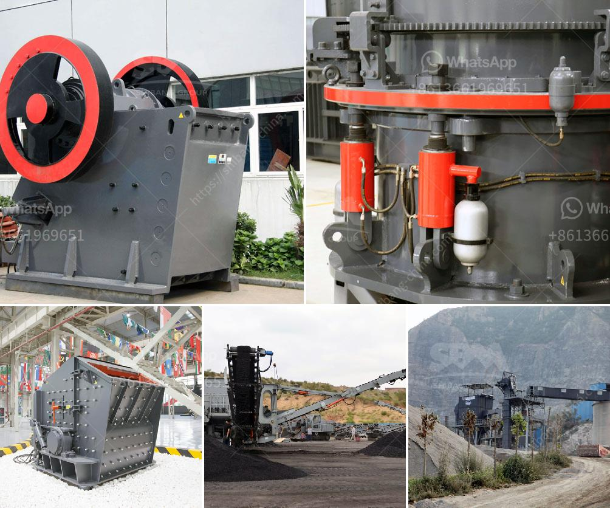

<h3>barite crushing machine</h3>
Barite, also known as baryte, is a mineral found in natural deposits all around the world. It is one of the most common minerals due to its widespread use in various fields ranging from construction to medicine. This mineral is primarily composed of barium sulfate (BaSO4), making it an essential component in drilling fluids for oil and gas wells, as well as in the manufacturing of paints, rubber, and plastics.

With such extensive usage, the demand for barite has been on the rise. To meet this growing demand, barite is extracted from the earth through mining. After being extracted, it undergoes various processes to remove impurities and enhance its purity. One crucial step in the entire process is the crushing of the barite rocks into smaller particles to facilitate easy handling and utilization.

The barite crushing machine plays a vital role in the process of converting large chunks of barite into fine powder, which is then used for various applications. From the market analysis, we can see that the crushing machine can achieve the maximum size of 600-1200 mm. In addition to the crusher machine, the whole barite production system also includes the important barite crushing machine that sublimates the barite on the basis of the previous requirement and the perfect series of circular vibrating screen and linear vibrating screen to realize the barite separation.

The barite crushing machine is designed to produce super-fine powder or micro powder of different materials with hardness less than 6 in Moh's scale and humidity less than 6 percent such as kaolin, limestone, calcite, marble, talcum, barite, gypsum, dolomite, bentonite mud, mica, pyrophyllite, sepiolite, diatomite, graphite, alunite, fluorite, potassium feldspar, phosphorite, pigment and so on.

As a leading manufacturer and supplier of mining and construction machines, Zenith Company has made a name for itself in the global barite crushing industry. Our machine has been sold to over 120 countries and regions like Indonesia, Nigeria, South Africa, Russia, Mexico, Canada, Australia, etc. Our barite crushing machine has been exported to many countries all over the world such as India, South Africa, Omen, Indonesia, Serbia, Zambia, Zimbabwe, Brazil, Russia, Kenya etc.

In order to meet the needs of customers, we also provide a complete set of barite crushing machine, including vibrating feeder, belt conveyor, grinding mill, etc. Our advanced technology and reliable quality equipment deliver the best return on investment for our customers. With our machine, you can get the desired barite fineness grade, making it suitable for a wide range of applications.

In conclusion, the barite crushing machine plays a significant role in the whole barite production process. It is essential for barite mining and processing plant, and it can be used independently or as part of a comprehensive barite crushing system. The use of the barite crushing machine will inevitably lead to various problems such as excessive working noise or dust pollution, but rest assured that manufacturers like Zenith are continuously improving and optimizing their machines to overcome these issues. With their reliability and efficiency, barite crushing machines are sure to play a crucial role in the mining industry for the foreseeable future.
<h3>Contact us</h3><ul><li><strong>Whatsapp:&nbsp;<a href="https://wa.me/8613661969651">+8613661969651</a></strong></li><li><a href="https://swt.shibang-china.com/?git&amp;zhl&amp;barite crushing machine"><strong>Online Service(chat now)</strong></a></li></ul><h3>Related</h3><ul><li><a href='coal pulverizer manufacturers.md'>coal pulverizer manufacturers</a></li><li><a href='hammer mill machine south africa.md'>hammer mill machine south africa</a></li><li><a href='raymond gypsum mill in india.md'>raymond gypsum mill in india</a></li><li><a href='belt conveyor untuk batubara.md'>belt conveyor untuk batubara</a></li><li><a href='rotary kilns in indonesia.md'>rotary kilns in indonesia</a></li></ul>