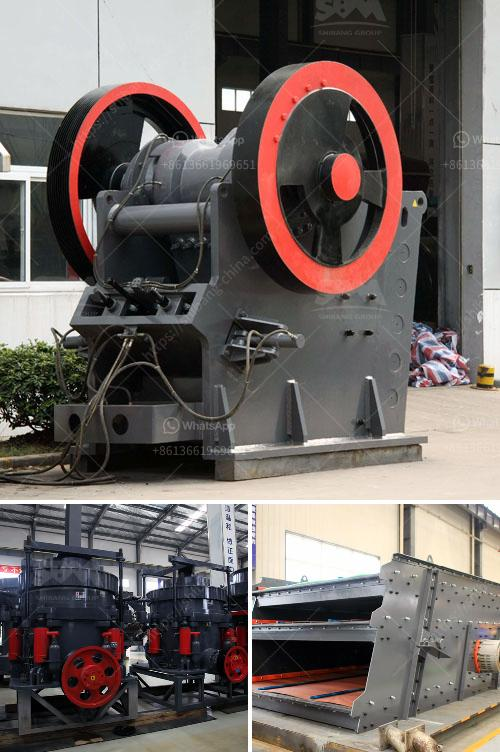

<h3>barite mill specifications</h3>
Barite is a mineral that is commonly used in various industries. It is mainly composed of barium sulfate and has a wide range of applications, including as a weighting agent in drilling fluids for oil and gas exploration, as well as in the manufacturing of paints, rubber, plastics, ceramics, and other products. To process barite into a fine powder, barite mills are used. In this article, we will explore the specifications of a typical barite mill.

A barite mill is a piece of equipment designed to process barite into fine powder. It is usually composed of a main grinding chamber, a motor, and other auxiliary equipment. The material enters the main grinding chamber through a vibrating feeder and is pulverized by the grinding roller and grinding ring. The powder is then collected by the powder collector, and the finished product is transported to the next process through the pipeline system.

The size and capacity of a barite mill can vary depending on the specific requirements of the customer. However, a typical barite mill has the following specifications:

1. Main motor power: The main motor is responsible for driving the grinding roller and grinding ring to rotate. The power of the motor directly affects the production capacity and grinding efficiency of the mill. Typically, the main motor power of a barite mill ranges from 30 to 315 kilowatts.

2. Grinding roller size and number: The grinding roller is a key component in the grinding process. It is responsible for exerting pressure on the grinding ring and grinding the material into fine powder. The size and number of grinding rollers can vary depending on the size and capacity of the mill. Typically, a barite mill has 3 to 5 grinding rollers with a diameter ranging from 250 to 460 millimeters.

3. Grinding ring diameter and height: The grinding ring is fixed on the inner wall of the main grinding chamber and provides a stable support for the grinding roller. The diameter and height of the grinding ring can affect the grinding efficiency and stability of the mill. Typically, the diameter of the grinding ring ranges from 780 to 1500 millimeters, while the height ranges from 150 to 300 millimeters.

4. Fineness of the finished product: The fineness of the barite powder produced by a mill is an important specification. It can be adjusted by changing the speed of the motor, the size of the grinding roller and grinding ring, and the airflow of the powder collector. Typically, a barite mill can produce powder with a fineness ranging from 325 to 3000 mesh.

In addition to these specifications, there may be other features and options available for a barite mill, including automatic control systems, advanced dust removal devices, and noise reduction measures. These features can improve the efficiency, safety, and environmental friendliness of the mill.

In conclusion, barite mills play a crucial role in the processing of barite into fine powder. Understanding the specifications of a barite mill can help customers choose the right equipment for their specific needs. It is important to consider factors such as motor power, grinding roller size and number, grinding ring diameter and height, and the fineness of the finished product when selecting a barite mill.
<h3>Contact us</h3><ul><li><strong>Whatsapp:&nbsp;<a href="https://wa.me/8613661969651">+8613661969651</a></strong></li><li><a href="https://swt.shibang-china.com/?git&amp;zhl&amp;barite mill specifications"><strong>Online Service(chat now)</strong></a></li></ul><h3>Related</h3><ul><li><a href='concrete conveyor belts.md'>concrete conveyor belts</a></li><li><a href='stone crusher for sale in uae.md'>stone crusher for sale in uae</a></li><li><a href='dolomite powder plant.md'>dolomite powder plant</a></li><li><a href='dolomite powder mill machinery.md'>dolomite powder mill machinery</a></li><li><a href='mining processing machine prices.md'>mining processing machine prices</a></li></ul>