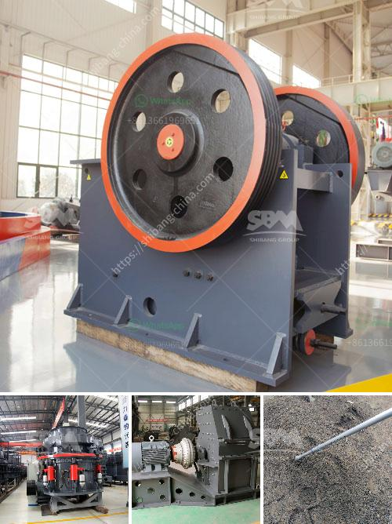

<h3>barite washing equipment</h3>
Barite is a vital mineral found in various industries due to its high specific gravity and low solubility. It is used in oil drilling fluids, ceramics, rubber, paint, paper, glass, and medical applications. However, before it can be used, barite needs to undergo a washing process to remove impurities and ensure its quality. This is where barite washing equipment plays a crucial role.

Barite washing equipment is designed to remove unwanted particles from barite through a series of washing and screening processes. The specific equipment used depends on the size of the ore deposit and the desired final product specifications. Generally, there are two main types of barite washing equipment: log washer and sand washer.

The log washer, also known as a paddle washer, utilizes mechanical action to scrub the barite ore and remove impurities. It consists of a large, rotating drum with paddles or blades that agitate and scrub the ore. The log washer can handle larger feed sizes and is suitable for washing high-grade barite ore. The paddles or blades inside the drum help break down clay and other contaminants, resulting in cleaner and higher quality barite.

On the other hand, the sand washer, also known as a spiral sand washing machine, operates by tumbling the barite ore with water in a rotating spiral-shaped drum. The spiral movement helps separate the ore from impurities and washes them away. The sand washer is more efficient in removing fine particles and is commonly used for washing lower-grade barite ore.

Both types of barite washing equipment can be equipped with multiple stages of washing and screening to achieve the desired level of purity. The washed barite is then transported to dewatering equipment, such as thickeners or centrifuges, to remove excess water before further processing.

However, it's important to note that barite washing equipment alone may not be sufficient to achieve the desired level of purity. In some cases, additional equipment like flotation cells or magnetic separators may be required to remove specific impurities or increase the barite grade.

The selection of the appropriate barite washing equipment depends on various factors such as the quality and quantity of the ore and the desired final product specifications. It is essential to work closely with a trusted supplier or manufacturer who can provide expert guidance and tailored solutions for your specific needs.

In conclusion, barite washing equipment plays a vital role in the barite processing industry. It helps remove impurities from the ore and ensures the quality of the final product. By utilizing equipment such as log washers or sand washers, industries can obtain clean and high-grade barite for various applications. When choosing barite washing equipment, it is important to consider factors such as ore quality, desired product specifications, and the expertise of the supplier.
<h3>Contact us</h3><ul><li><strong>Whatsapp:&nbsp;<a href="https://wa.me/8613661969651">+8613661969651</a></strong></li><li><a href="https://swt.shibang-china.com/?git&amp;zhl&amp;barite washing equipment"><strong>Online Service(chat now)</strong></a></li></ul><h3>Related</h3><ul><li><a href='iron crusher supplier.md'>iron crusher supplier</a></li><li><a href='cement processing plant.md'>cement processing plant</a></li><li><a href='hammer crusher price one ton per hour.md'>hammer crusher price one ton per hour</a></li><li><a href='mobile crusher plant price in india.md'>mobile crusher plant price in india</a></li><li><a href='financial statements of miningpanies.md'>financial statements of miningpanies</a></li></ul>