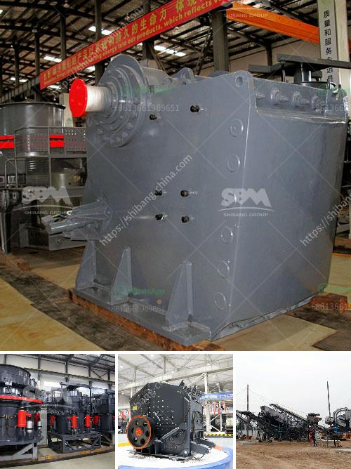

<h3>basalt crushing line</h3>
When it comes to constructing roads, pavements, and buildings, it is essential to have a sturdy and durable foundation. Basalt, a common igneous rock formed from the rapid cooling of lava, provides the ideal material for such purposes. Its exceptional hardness, high resistance to weathering, and excellent load-bearing capacity make it an excellent building material. To maximize the potential of this unique stone, the process of basalt crushing is crucial.

To extract basalt from its natural resources, it goes through a series of crushing stages, each designed to gradually reduce the size of the extracted material. The basalt crushing line is composed of primary crusher, secondary crusher, and vibrating feeder.

First, the large basalt blocks are crushed by the primary crusher, which is typically a jaw crusher. After the primary crushing, the smaller particles are then transferred to the secondary crusher, often a cone crusher, for further reduction. Both crushers utilize compression force to break the particles and create a more uniformly sized product. This two-step process ensures an effective and controlled reduction of the basalt size.

To facilitate the crushing process, a vibrating feeder is used to transport the extracted basalt into the crushers. This feeder not only ensures a constant and even feed rate but also maximizes efficiency by removing any oversize particles or foreign materials. The vibrating feeder significantly reduces the risk of clogging or damaging the crushers, maintaining a smooth flow of basalt throughout the entire crushing line.

Once the basalt has been crushed into the desired size, it can then be used as an aggregate in asphalt and concrete production. The crushed basalt particles enhance the overall strength and durability of these construction materials. In addition to its load-bearing capacity, basalt also has excellent frost resistance, making it an ideal material for road construction, particularly in colder climates.

Another advantage of using a basalt crushing line is the potential for recycling. By crushing and reusing the extracted basalt, it effectively conserves natural resources and reduces waste. The recycled basalt can be further processed and transformed into different products such as aggregate for road base, soil stabilizers, or even used as a raw material for producing cement. This sustainable approach not only contributes to environmental preservation but also reduces the overall cost of construction.

Furthermore, the basalt crushing line can be customized to meet specific requirements. It can be designed to process a wide range of materials, from different basalt grades to other types of rocks such as granite or limestone. Moreover, the output size can be adjusted according to the desired specifications, ensuring that the resulting product perfectly suits the intended application.

In conclusion, the basalt crushing line plays a critical role in building a solid foundation for various construction projects. By harnessing the exceptional properties of basalt, it guarantees durability, strength, and sustainability. Whether used as an aggregate or recycled for other applications, the basalt crushing line proves to be an essential component in the construction industry.
<h3>Contact us</h3><ul><li><strong>Whatsapp:&nbsp;<a href="https://wa.me/8613661969651">+8613661969651</a></strong></li><li><a href="https://swt.shibang-china.com/?git&amp;zhl&amp;basalt crushing line"><strong>Online Service(chat now)</strong></a></li></ul><h3>Related</h3><ul><li><a href='sp 60x100 jaw crusher.md'>sp 60x100 jaw crusher</a></li><li><a href='quartz crushers price in india.md'>quartz crushers price in india</a></li><li><a href='vibrating feeder vs belt conveyor.md'>vibrating feeder vs belt conveyor</a></li><li><a href='stone crusher aggregate supplier kota.md'>stone crusher aggregate supplier kota</a></li><li><a href='ball mills sizes.md'>ball mills sizes</a></li></ul>