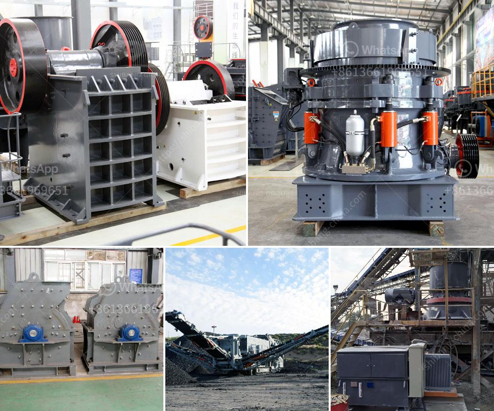

<h3>basalt manufacturing plant</h3>
A basalt manufacturing plant is emerging as a key player in revolutionizing the construction industry. Basalt, a volcanic rock known for its durability and strength, is being harnessed by innovative manufacturing facilities to create a wide range of products for the construction sector.

The manufacturing process of basalt starts with the extraction of natural volcanic rock from quarries. This raw material is then crushed into small pieces and heated at high temperatures. The molten basalt is then extruded into various shapes and sizes, depending on the intended application.

One of the significant advantages of basalt manufacturing plants is the environmental friendliness of the process. Basalt is a natural material and does not require extensive use of energy or harmful chemicals during the manufacturing process. Additionally, the rock is abundant and can be sourced locally, reducing carbon emissions associated with transportation.

The products manufactured by basalt plants are highly versatile and find application in a variety of construction projects. Basalt fiber, for example, is a lightweight and durable material that can be used as reinforcement in concrete structures, improving their strength and durability. Basalt fiber-reinforced polymers (BFRP) are also being increasingly used as an alternative to traditional steel reinforcements, as they offer higher resistance to corrosion and are non-magnetic.

Basalt manufacturing plants also produce basalt ceramic tiles, highly resistant to wear and tear, making them ideal for high-traffic areas such as airports and shopping malls. The tiles are available in various colors, patterns, and finishes, allowing architects and designers to create visually striking and long-lasting spaces.

The construction industry is increasingly adopting sustainable practices, and basalt manufacturing plants align perfectly with this agenda. Basalt products are not only durable and long-lasting, reducing the need for frequent replacements, but they also have a minimal impact on the environment.

In conclusion, basalt manufacturing plants are transforming the construction industry by harnessing the inherent strength and durability of volcanic rock. The versatility of basalt products allows for their integration into various construction applications, ranging from reinforcement in concrete structures to the production of ceramic tiles. With their environmentally-friendly manufacturing process, basalt plants are paving the way for sustainable construction practices in the future.
<h3>Contact us</h3><ul><li><strong>Whatsapp:&nbsp;<a href="https://wa.me/8613661969651">+8613661969651</a></strong></li><li><a href="https://swt.shibang-china.com/?git&amp;zhl&amp;basalt manufacturing plant"><strong>Online Service(chat now)</strong></a></li></ul><h3>Related</h3><ul><li><a href='stone quarry crusher in kasoa.md'>stone quarry crusher in kasoa</a></li><li><a href='vibrating screen size decision.md'>vibrating screen size decision</a></li><li><a href='gold crusher in south africa.md'>gold crusher in south africa</a></li><li><a href='crusher equipment supplier.md'>crusher equipment supplier</a></li><li><a href='limestone quarry mining plant price.md'>limestone quarry mining plant price</a></li></ul>