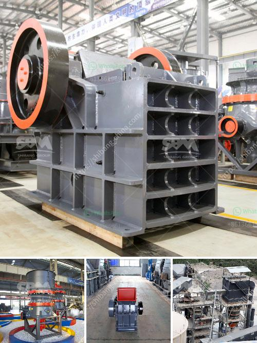

<h3>basalt powder machine supplier uk</h3>
Basalt is a common rock formation that is typically formed from the rapid cooling of lava. It has a wide range of uses, from construction materials to decorative landscaping. In recent years, the demand for basalt powder has been increasing, especially in the UK, where it is used in various industries. As a result, the need for reliable basalt powder machine suppliers has also grown.

A basalt powder machine is a type of industrial equipment that is used to crush or grind basalt into small particles. This machine is widely used in many industries, such as construction, mining, smelting, metallurgy, chemical, and so on. It is essential for the production of basalt powder, which can be further used for various purposes.

The UK is known for its advanced industrial technology and machinery. Thus, it is no surprise that there are several basalt powder machine suppliers in the country. These suppliers offer a wide range of machines that are capable of efficiently crushing and grinding basalt. Some of the machines available include jaw crushers, cone crushers, impact crushers, and grinding mills.

When looking for a basalt powder machine supplier in the UK, it is crucial to consider several factors. Firstly, the supplier should have a good reputation in the industry, providing reliable and durable machines. It is also important to consider the after-sales service provided by the supplier, as it can be crucial for maintaining the machine's performance.

Furthermore, it is advisable to compare prices and quality from different suppliers to ensure you are getting the best value for your investment. Additionally, take into account the supplier's experience and expertise in the field. This can be determined by looking at their track record and customer reviews.

In conclusion, the demand for basalt powder in the UK has been rising, resulting in the need for reliable basalt powder machine suppliers. When seeking a supplier, consider factors such as reputation, after-sales service, price, quality, and experience. By doing so, you can ensure you are partnering with a reputable supplier who can provide the necessary equipment for your basalt powder production requirements.
<h3>Contact us</h3><ul><li><strong>Whatsapp:&nbsp;<a href="https://wa.me/8613661969651">+8613661969651</a></strong></li><li><a href="https://swt.shibang-china.com/?git&amp;zhl&amp;basalt powder machine supplier uk"><strong>Online Service(chat now)</strong></a></li></ul><h3>Related</h3><ul><li><a href='roller crusher price list.md'>roller crusher price list</a></li><li><a href='concrete crusher kenya.md'>concrete crusher kenya</a></li><li><a href='china raymond mill company.md'>china raymond mill company</a></li><li><a href='buy fully gold mining wash plant.md'>buy fully gold mining wash plant</a></li><li><a href='ballast ore crusher for sale in kenya.md'>ballast ore crusher for sale in kenya</a></li></ul>