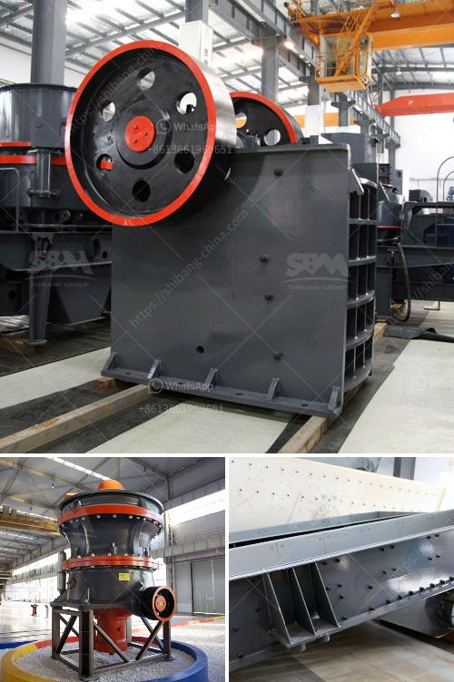

<h3>basalt processing plant</h3>
Basalt is a common igneous rock formed from lava flows during volcanic eruptions. It is typically dark in color and has a fine-grained texture. Due to its durability and ability to withstand extreme temperatures, basalt has a wide range of applications, making it a highly sought-after material in various industries, such as construction, manufacturing, and landscaping.

To meet the growing demand for basalt materials, many companies have established basalt processing plants. These facilities are designed to extract the raw basalt from quarries and transform it into different products suited for specific applications.

The first step in the basalt processing plant is the extraction of raw materials from the quarry. Explosives are used to break down the basaltic rock into smaller pieces that can be easily transported. Excavators and loaders then collect and transport the rock to the primary crusher for initial crushing.

The primary crusher reduces the raw basalt to smaller sizes, typically less than 6 inches in diameter. From there, the crushed basalt is transported to secondary and tertiary crushers for further reduction. The crushers use various types of machinery, such as cone crushers, jaw crushers, or impact crushers, depending on the desired end product.

Once the basalt has been crushed to the desired size, it undergoes several processes to produce different materials. One common product is basalt aggregate, which is used in the construction industry as a stable foundation material for roads, buildings, and pavements. The aggregate is created by screening the crushed basalt to separate it into various sizes.

In addition to aggregate, the basalt processing plant can also produce basalt fibers. These fibers are made by melting the crushed basalt at high temperatures and then extruding the molten material through tiny nozzles. The resulting fibers can be used as a reinforcement material in concrete, plastics, and composites due to their high strength and resistance to heat and chemicals.

Another product that can be produced in the basalt processing plant is basalt powder. This fine powder is used as a raw material in various industries, including ceramics, paints, and coatings. It can also be used as a soil amendment to improve soil fertility and plant growth.

Overall, the basalt processing plant plays a crucial role in turning raw basalt into valuable products used in a wide range of industries. These plants employ advanced technology and machinery to ensure efficient and environmentally friendly processing. As the demand for basalt materials continues to grow, these processing plants will play an increasingly important role in meeting industrial needs while minimizing the impact on the environment.
<h3>Contact us</h3><ul><li><strong>Whatsapp:&nbsp;<a href="https://wa.me/8613661969651">+8613661969651</a></strong></li><li><a href="https://swt.shibang-china.com/?git&amp;zhl&amp;basalt processing plant"><strong>Online Service(chat now)</strong></a></li></ul><h3>Related</h3><ul><li><a href='mini stone crusher for sale.md'>mini stone crusher for sale</a></li><li><a href='basalt rebar production line.md'>basalt rebar production line</a></li><li><a href='industrial conveyor belts dimensions.md'>industrial conveyor belts dimensions</a></li><li><a href='ballast crushing equipment.md'>ballast crushing equipment</a></li><li><a href='grinding of copper ores.md'>grinding of copper ores</a></li></ul>