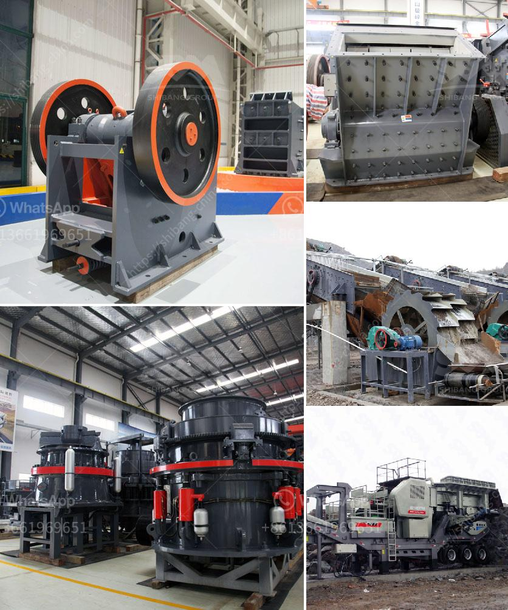

<h3>basalt rebar production line</h3>
Basalt rebar, also known as volcanic rock rebar, is a type of reinforcement material that is gaining popularity in the construction industry due to its exceptional properties. It is produced from basalt, a volcanic rock that is found abundantly in many parts of the world. Basalt rebar offers significant advantages over traditional steel rebar, such as its superior strength, durability, and resistance to corrosion. To meet the growing demand for this innovative material, companies have set up basalt rebar production lines that ensure efficient and high-quality manufacturing processes.

A basalt rebar production line is a series of machines and equipment that are used to convert raw basalt rocks into finished rebar products. The process typically starts with the extraction of basalt rocks from quarries or mines. These rocks are then crushed into smaller pieces using crushers, and any impurities or unwanted materials are removed. The basalt is then heated at high temperatures to melt it and convert it into molten basalt, also known as basalt lava.

Once the basalt lava is obtained, it is further processed through a series of stages to form basalt fiber. This involves the spinning of the molten basalt through a spinneret, similar to the process used to produce other synthetic fibers. The spinning process creates thin continuous fibers of basalt, which are then collected and wound onto spools. These basalt fibers have high tensile strength and are resistant to chemicals, making them ideal for reinforcing various concrete structures.

After the basalt fiber is obtained, it is further processed to transform it into basalt rebar. This involves impregnating the fibers with a resin binder and winding them onto reels to form a continuous rod. The rod is then cut into desired lengths and subjected to heat treatment to enhance its mechanical properties. Finally, the basalt rebar is made ready for distribution and use in various construction projects.

The production line for basalt rebar involves the use of automated machines and equipment at each stage of the manufacturing process. This ensures precision and consistency in the quality of the final product. Additionally, the production line is designed to minimize waste and optimize the use of raw materials, making it an environmentally friendly choice.

The utilization of basalt rebar in construction offers several advantages over traditional steel rebar. Basalt rebar is significantly lighter than steel, making it easier to handle and transport. It also has higher tensile strength, allowing for thinner and lighter concrete structures without compromising their overall strength and stability. Furthermore, basalt rebar does not corrode, eliminating the need for expensive maintenance and repair work.

In conclusion, the establishment of basalt rebar production lines has revolutionized the construction industry by providing a superior alternative to steel rebar. The process involves converting basalt rocks into basalt fiber, which is then impregnated with a resin binder and transformed into basalt rebar. The production line ensures efficient manufacturing processes, high-quality products, and minimal waste. The utilization of basalt rebar offers numerous benefits, including increased strength, durability, and corrosion resistance. As the construction industry continues to embrace sustainable and innovative materials, basalt rebar is poised to play a significant role in shaping the future of infrastructure development.
<h3>Contact us</h3><ul><li><strong>Whatsapp:&nbsp;<a href="https://wa.me/8613661969651">+8613661969651</a></strong></li><li><a href="https://swt.shibang-china.com/?git&amp;zhl&amp;basalt rebar production line"><strong>Online Service(chat now)</strong></a></li></ul><h3>Related</h3><ul><li><a href='crusher screening process in dolomite.md'>crusher screening process in dolomite</a></li><li><a href='europe used grinding equipment.md'>europe used grinding equipment</a></li><li><a href='crushing stone crusher in spinal.md'>crushing stone crusher in spinal</a></li><li><a href='rock crusher screen.md'>rock crusher screen</a></li><li><a href='river sand mining machine for sale.md'>river sand mining machine for sale</a></li></ul>