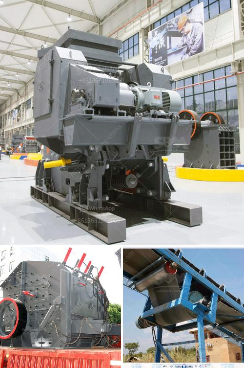

<h3>bauxite mining process</h3>
Bauxite is a mineral bearing rock that is primarily composed of aluminum; however, it is also found in other elements such as iron and silicon. It is extracted through the open-pit mining method and carries a range of physical and chemical properties that make it highly valuable in various industries.

The process of mining bauxite starts with the excavation of the land, which is then stripped of vegetation and topsoil to expose the bauxite-rich layers underneath. This allows for easier extraction as bauxite ore is relatively shallow, typically found at a depth of 1-2 meters.

After the initial excavation, the bauxite is broken up and transported to the beneficiation plant where it is crushed and ground into smaller particles. This process not only enhances the quality of the ore but also removes impurities and foreign matter that may be present.

The next step involves the separation of the valuable aluminum-rich minerals from the surrounding rock and minerals. This is usually done through a process called wet screening, where the crushed bauxite is mixed with water to form a slurry. The slurry is then passed through various screens of different sizes to separate the bauxite particles based on their size.

Once the bauxite ore has been sorted, it is ready for the extraction of aluminum through a process called the Bayer process. In this method, the crushed and sorted bauxite ore is mixed with a hot solution of sodium hydroxide. The mixture is then filtered to separate the solid residue, known as "red mud," from the liquid, which contains the dissolved aluminum compounds.

The liquid is then subjected to a series of chemical reactions and clarifications to obtain pure aluminum hydroxide, which is the precursor for aluminum production. The aluminum hydroxide is then calcined at high temperatures to remove excess water and transform it into alumina, a white powdery substance.

The alumina is then transported to aluminum smelters where it undergoes electrolysis to produce pure aluminum metal. This process involves passing an electric current through a molten bath of alumina dissolved in molten cryolite, a mixture that reduces the melting point of alumina and facilitates aluminum extraction. The electric current breaks down the alumina into aluminum and oxygen ions, with the aluminum ions accumulating at the cathode and the oxygen ions evolving at the anode.

Overall, the bauxite mining process involves several steps starting from the excavation of the land to the extraction of aluminum. The open-pit mining method is an efficient and cost-effective option for bauxite extraction, making it a prominent choice for mining companies. The extracted bauxite is then refined to obtain alumina, which serves as the precursor for aluminum production, benefiting a wide range of industries, including construction, transportation, and packaging.
<h3>Contact us</h3><ul><li><strong>Whatsapp:&nbsp;<a href="https://wa.me/8613661969651">+8613661969651</a></strong></li><li><a href="https://swt.shibang-china.com/?git&amp;zhl&amp;bauxite mining process"><strong>Online Service(chat now)</strong></a></li></ul><h3>Related</h3><ul><li><a href='mobile stone crusher plant.md'>mobile stone crusher plant</a></li><li><a href='roller grinding machines for sale.md'>roller grinding machines for sale</a></li><li><a href='best portable jaw crusher granite.md'>best portable jaw crusher granite</a></li><li><a href='dolomite crushers for sale.md'>dolomite crushers for sale</a></li><li><a href='marble quarry business plan.md'>marble quarry business plan</a></li></ul>