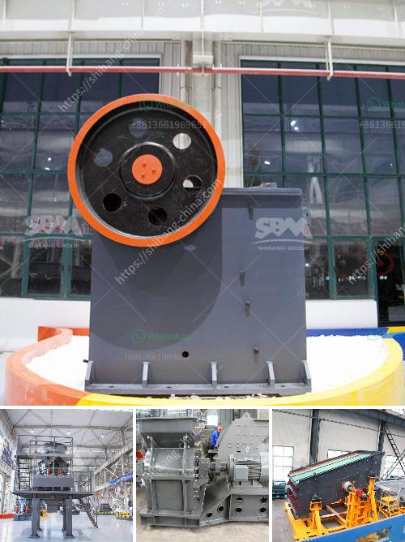

<h3>bauxite production line</h3>
Bauxite, the ore from which aluminum is extracted, is one of the most important minerals in today's world. With a wide range of applications, its demand continues to rise globally. To meet this growing demand, bauxite production lines have become instrumental in ensuring a steady supply of this essential mineral.

A bauxite production line is a complex industrial system that involves various processes and machinery to extract and refine bauxite into alumina, which is then used to produce aluminum. This process begins with the mining of bauxite, which is typically found in tropical and subtropical regions. Once mined, the bauxite ore undergoes several stages of processing before it can be transformed into alumina.

The first step in the production line is the crushing of the bauxite ore into smaller particles. This is usually done using a primary crusher that can handle large chunks of rock. After the initial crushing, the bauxite is then transported to a secondary crusher, where it is further reduced in size. This process ensures that the mined ore is suitable for the subsequent refining stages.

The next stage in the production line is the grinding of the crushed bauxite. This process involves using a ball mill or other grinding equipment to pulverize the ore into a fine powder. The finely ground bauxite is then mixed with a sodium hydroxide solution and heated in a digester, resulting in the dissolution of alumina from the ore.

The alumina solution obtained from the digester is then clarified and filtered to remove any impurities. The resulting liquid is then subjected to a precipitation process, where alumina crystals are generated. These crystals are then washed, dried, and calcined at high temperatures to remove any remaining moisture and transform them into aluminum oxide.

Finally, the aluminum oxide is sent to a smelter, where it is electrolytically reduced to obtain aluminum metal. This aluminum can be further processed and shaped into various forms, such as sheets, bars, or ingots, depending on the intended use.

A well-designed bauxite production line is essential for efficient and economical bauxite extraction and refining. It requires a careful balance between the mining process, the crushing and grinding stages, and the subsequent refining processes. Each step must be optimized to ensure a high-quality product while minimizing energy consumption and environmental impact.

Bauxite production lines often incorporate advanced technologies and automation systems to enhance productivity and reduce human intervention. These technological advancements include robotics, monitoring sensors, and advanced control systems that optimize each stage of the process. These innovations help to improve efficiency, increase safety, and reduce operational costs.

In conclusion, bauxite production lines play a crucial role in meeting the global demand for aluminum. By effectively extracting and refining bauxite, these production lines ensure a steady supply of this essential mineral. Through a series of processes, bauxite is transformed into alumina, which is then used to produce aluminum for a wide range of applications. The continuous enhancements in technology and automation have revolutionized the bauxite production process, making it more efficient, sustainable, and economically viable.
<h3>Contact us</h3><ul><li><strong>Whatsapp:&nbsp;<a href="https://wa.me/8613661969651">+8613661969651</a></strong></li><li><a href="https://swt.shibang-china.com/?git&amp;zhl&amp;bauxite production line"><strong>Online Service(chat now)</strong></a></li></ul><h3>Related</h3><ul><li><a href='pakistan crusher machine complete.md'>pakistan crusher machine complete</a></li><li><a href='crushing machine manufacturers china.md'>crushing machine manufacturers china</a></li><li><a href='cement production process.md'>cement production process</a></li><li><a href='vibrating screen supplier philippines.md'>vibrating screen supplier philippines</a></li><li><a href='chromite ore flowsheet pdf.md'>chromite ore flowsheet pdf</a></li></ul>