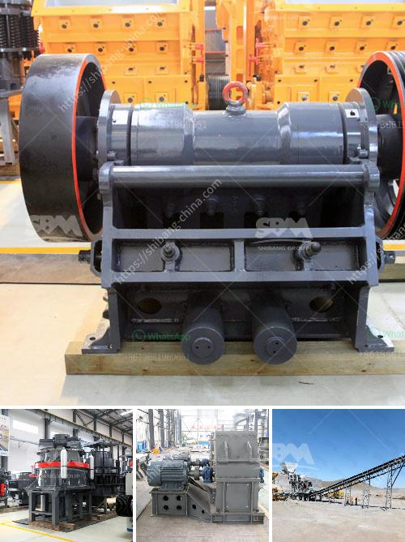

<h3>bazer stone crusher</h3>
Stone crushing industry is an important industrial sector in the country engaged in producing crushed stone and aggregates for various construction applications. The demand for crushed stone has been growing rapidly, as cities and towns expand due to the increasing population and infrastructure development. In order to meet the growing demand, stone crusher units are established in different parts of the country. 

When it comes to stone crushing equipment, one name stands out - Bazer. Bazer Stone Crusher is an innovative company in the field of stone crushing technology. Their team of engineers and technical designers have the expertise and experience to produce state-of-the-art crushers that deliver unparalleled performance. They strive to exceed customer expectations with their commitment to continuous improvement and innovation. 

What sets Bazer Stone Crusher apart from the rest is their focus on precision engineering, quality manufacturing, and excellent after-sales service. The company understands the needs of the customer and designs crushers that meet their specific requirements. With a range of models to choose from, Bazer crushers are designed for maximum productivity and efficiency. 

The Bazer Jaw Crusher features advanced design concepts, such as high reduction ratio, optimized cavity geometry, and increased throughput capacity. Designed with a sturdy and durable construction, it delivers consistently high crushing performance even in the toughest conditions. The jaw crusher is equipped with a reliable and efficient hydraulic system that ensures easy adjustment of the CSS (closed side setting) for precise control of the product size. 

Bazer Cone Crushers are designed and engineered for maximum productivity and efficiency. The rugged construction, along with high quality components, ensures reliable and long-lasting performance. The cone crushers are equipped with advanced hydraulic system that provides automatic overload protection and allows clearing of the crushing chamber in case of blockages. The large feed opening and wide range of crushing strokes ensure exceptional throughput capacity. 

Bazer VSI crushers are designed with precision. The patented Bi-Flow system ensures reduced wear rates and prolonged uptime for the crushers. The VSI crushers produce cubical shaped and high-quality sand, which is in high demand for construction purposes. The unique combination of rotor design, wear material, and crushing chamber configuration ensures efficient operation and reduced operating costs. 

Apart from crushers, Bazer also offers a wide range of screens, feeders, conveyors, and other material handling equipment. These products are designed to complement the crushers and provide a complete solution for crushing and screening applications. 

With their commitment to quality and customer satisfaction, Bazer Stone Crusher has established itself as a trustworthy and reliable brand in the industry. The company’s products are backed by extensive research, rigorous testing, and continuous improvement. Bazer Stone Crusher not only meets the demands of customers but exceeds them, setting new standards in the industry. 

In conclusion, Bazer Stone Crusher is an innovative company that brings state-of-the-art technology in the field of crushing and screening equipment. With their unparalleled dedication to customer service and quality manufacturing, they are poised to make a significant impact in the industry. Whether it is for mining, construction, or recycling, Bazer Stone Crusher has the perfect solution for all kinds of crushing requirements.
<h3>Contact us</h3><ul><li><strong>Whatsapp:&nbsp;<a href="https://wa.me/8613661969651">+8613661969651</a></strong></li><li><a href="https://swt.shibang-china.com/?git&amp;zhl&amp;bazer stone crusher"><strong>Online Service(chat now)</strong></a></li></ul><h3>Related</h3><ul><li><a href='ball mill construction.md'>ball mill construction</a></li><li><a href='ton hour coal crusher and screen.md'>ton hour coal crusher and screen</a></li><li><a href='used portable roller crushers and screens.md'>used portable roller crushers and screens</a></li><li><a href='coal washing process yotube.md'>coal washing process yotube</a></li><li><a href='used quarry equipment from usa.md'>used quarry equipment from usa</a></li></ul>