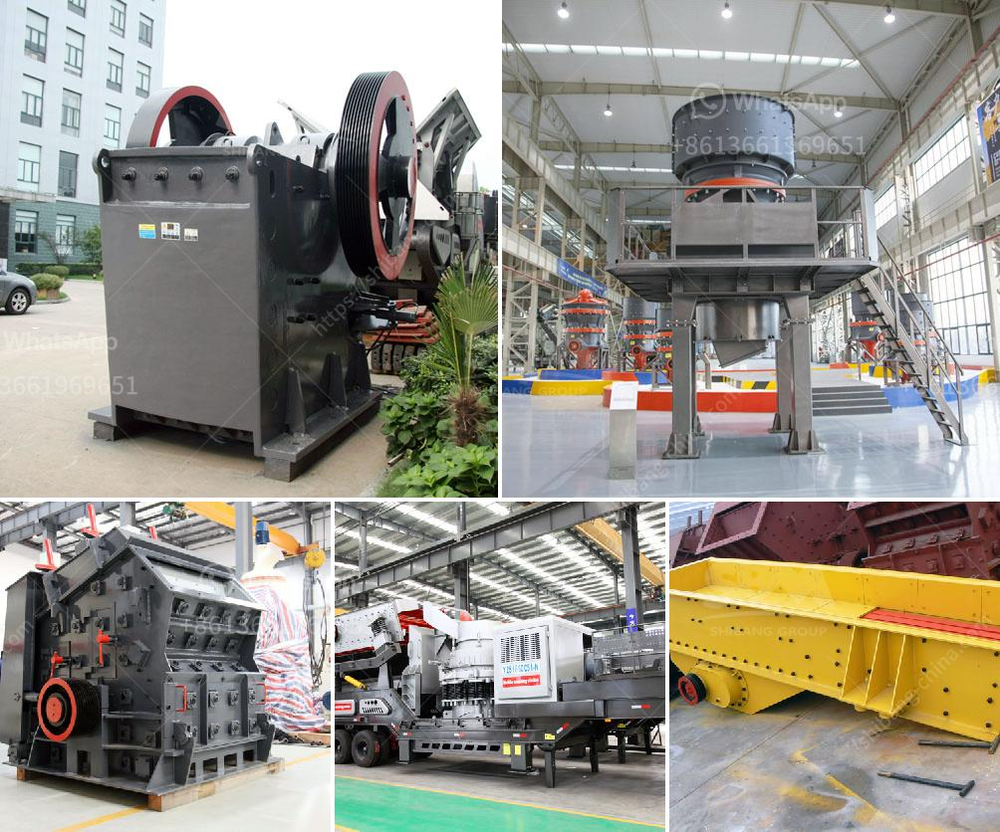

<h3>belt conveyor design procedure</h3>
Belt conveyors are the most commonly used method for transportation of bulk materials. They employ a continuous loop of conveyor belt to transport materials from one point to another. Belt conveyors are available in a variety of configurations and can be used horizontally or inclined.

The design of a belt conveyor system involves determining the belt width, belt speed, and belt tension necessary to create a desired carrying capacity. These factors are influenced by factors such as the material being conveyed, the length and incline of the conveyor, and the specific requirements of the application.

To begin the design process, it is important to determine the material's characteristics, such as size, weight, and flow rate. This information will help in selecting the appropriate belt width and speed.

The belt width should be wide enough to accommodate the material without excessive spillage or material buildup. It is important to consider the material's lump size and shape, as larger lumps may require a wider belt to prevent blockage.

The belt speed is determined by the desired carrying capacity and the material’s flow rate. A higher belt speed will result in a higher capacity but may also increase wear and maintenance requirements for the conveyor system.

The belt tension is determined by the load on the conveyor and the friction between the belt and the pulleys. Proper tension is important to prevent belt slippage and ensure smooth operation.

Other factors to consider during the design process include the conveyor's length, incline, and any additional components, such as drive units and support structures. The length and incline will impact the power requirements and the amount of support required to ensure proper operation.

Once the initial design parameters are determined, it is important to consider the safety and maintenance requirements of the conveyor system. This includes ensuring proper guarding and emergency stop controls are in place and that routine maintenance is scheduled to prevent downtime.

In conclusion, the design of a belt conveyor system involves considering various factors to determine the appropriate belt width, speed, and tension. This ensures efficient transportation of bulk materials while considering safety and maintenance requirements.
<h3>Contact us</h3><ul><li><strong>Whatsapp:&nbsp;<a href="https://wa.me/8613661969651">+8613661969651</a></strong></li><li><a href="https://swt.shibang-china.com/?git&amp;zhl&amp;belt conveyor design procedure"><strong>Online Service(chat now)</strong></a></li></ul><h3>Related</h3><ul><li><a href='indopol roller grinding mills.md'>indopol roller grinding mills</a></li><li><a href='vertical vertical roller mill.md'>vertical vertical roller mill</a></li><li><a href='kaolin processing machinery.md'>kaolin processing machinery</a></li><li><a href='basalt rebar production line.md'>basalt rebar production line</a></li><li><a href='used crushers sale usa.md'>used crushers sale usa</a></li></ul>