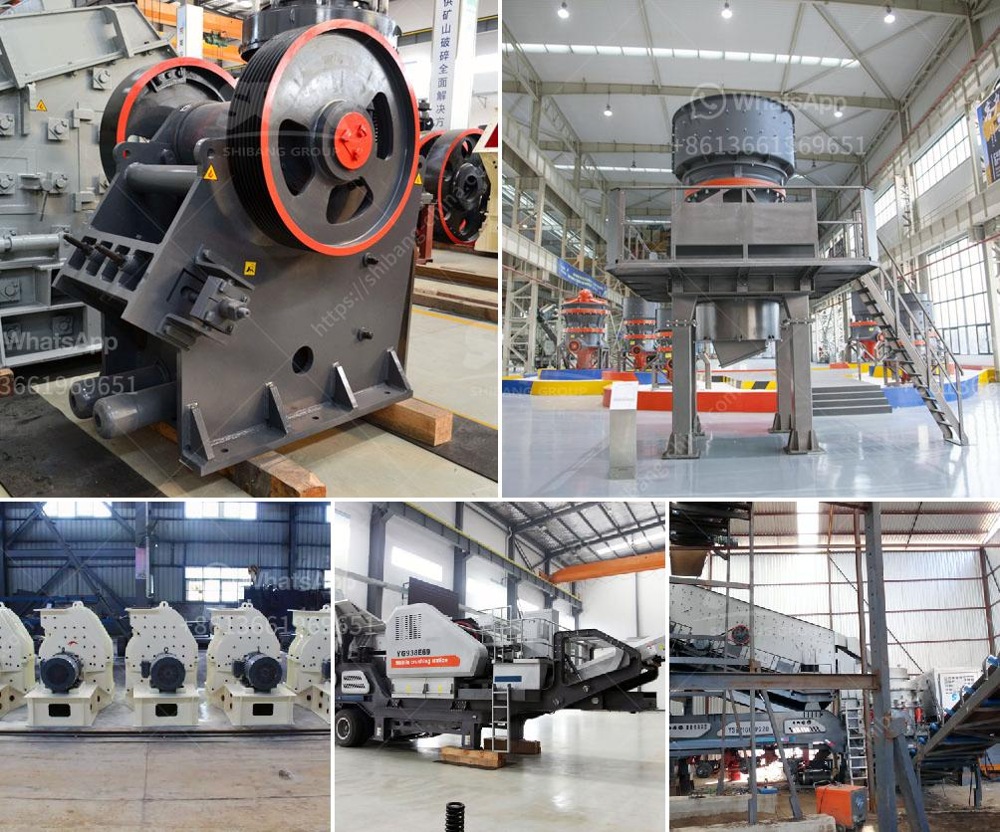

<h3>belt conveyor untuk batubara</h3>
In the mining industry, coal plays a crucial role in providing energy to power plants and industries worldwide. To meet the increasing demand for coal, efficient and reliable coal handling systems are essential. One such system that has proven its effectiveness over the years is the belt conveyor for batubara (Indonesian term for coal).

A belt conveyor is a mechanical device used to transport materials from one location to another. It consists of a belt, which is looped continuously over pulleys and rotates them, providing a means for transporting materials. In the case of batubara, the belt conveyor is specifically designed to handle coal efficiently and safely.

One of the main advantages of using a belt conveyor for batubara is its high capacity. With the ability to transport large volumes of coal over long distances, this system significantly increases productivity and reduces handling costs. It eliminates the need for manual labor or multiple transfers, ensuring a continuous and seamless flow of coal from the mining site to the storage area or directly to the power plant.

Moreover, a belt conveyor for batubara is also environmentally friendly. It reduces the risk of environmental pollution by minimizing coal spillage and dust emissions. The tightly sealed conveyor belt prevents coal fines and particles from escaping, ensuring a clean and safe working environment. Additionally, as it requires minimal maintenance and does not consume energy during operation, it contributes to the overall sustainability of coal handling operations.

Safety is another notable aspect of the belt conveyor for batubara. Its design includes numerous safety features to protect workers and avoid accidents. Emergency stops, trip switches, and protective covers are installed along the conveyor belt to provide immediate safety measures in case of any potential hazards. Furthermore, the automated nature of the system reduces the risk of physical strain or injuries associated with manual labor.

In terms of installation and flexibility, a belt conveyor for batubara offers various options. It can be installed both above and below ground, adapting to the specific needs and constraints of each mining site. The belt conveyor can also be customized to fit different terrains or overcome obstacles such as slopes or bends. This flexibility enables efficient coal transportation regardless of the geographical conditions or layout of the mining operation.

To ensure optimal performance and longevity, regular maintenance and inspections are required for the belt conveyor. Routine checks on the belt tension, pulley alignment, and spillage control are essential to prevent any potential issues and maintain the system's efficiency. Proper lubrication and cleaning are also necessary to reduce wear and tear and extend the conveyor's lifespan.

In conclusion, the belt conveyor for batubara is a reliable and efficient solution for coal handling in the mining industry. Its high capacity, environmental friendliness, safety features, and flexibility make it an ideal choice for coal transportation. By utilizing this system, mining operations can ensure a seamless and cost-effective flow of batubara, contributing to the overall energy supply and economic growth.
<h3>Contact us</h3><ul><li><strong>Whatsapp:&nbsp;<a href="https://wa.me/8613661969651">+8613661969651</a></strong></li><li><a href="https://swt.shibang-china.com/?git&amp;zhl&amp;belt conveyor untuk batubara"><strong>Online Service(chat now)</strong></a></li></ul><h3>Related</h3><ul><li><a href='cost of setting up a quarry crusher plant.md'>cost of setting up a quarry crusher plant</a></li><li><a href='stone crusher plant for sale.md'>stone crusher plant for sale</a></li><li><a href='talcum powder bp usp manufacturers in india.md'>talcum powder bp usp manufacturers in india</a></li><li><a href='tertiary impact crushers for quartz.md'>tertiary impact crushers for quartz</a></li><li><a href='gravel crusher supplier in the philippines.md'>gravel crusher supplier in the philippines</a></li></ul>