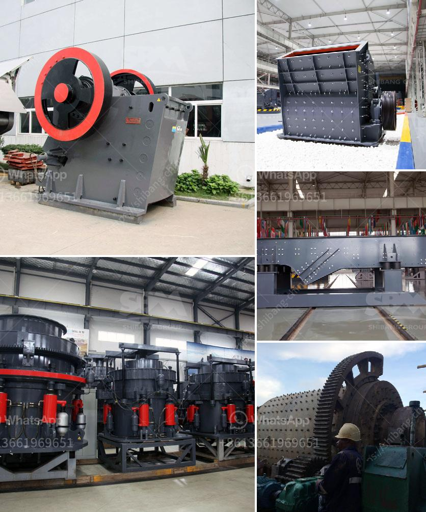

<h3>beneficiation plant process line diagram</h3>
A beneficiation plant is a complex process that requires ample knowledge and expertise. In simple terms, it is a process that involves separating valuable minerals from their ores to create a high-grade concentrate. This article will provide a brief overview of a typical beneficiation plant process line diagram.

The first step in the beneficiation process is crushing and grinding the ore to a fine powder. This finely ground ore is then mixed with water and a reagent, which helps in separating the desired minerals from the rest of the ore. The resulting mixture is known as a slurry.

The slurry is then fed into a series of flotation cells, where air is pumped through the mixture. The minerals attach to the air bubbles and rise to the surface, forming a foam. This foam is known as the concentrate, which contains the valuable minerals.

The non-valuable minerals, known as the tailings, sink to the bottom of the flotation cells and are removed. These tailings are usually pumped to a tailings dam, where they are stored for future use or disposal.

The concentrate is further processed in a drying unit, where excess water and moisture are removed, resulting in a dry concentrate. This dry concentrate is then sent to a smelter or a refinery, where it is further processed to extract the desired minerals.

Throughout the beneficiation process, various steps are taken to ensure the efficiency and quality of the final product. These steps include constant monitoring, adjusting reagents and operating conditions, and performing regular maintenance on equipment.

In conclusion, a beneficiation plant process line diagram involves several stages, including crushing, grinding, flotation, drying, and further processing. This process aims to separate valuable minerals from their ores to create a high-grade concentrate. It requires specialized knowledge and expertise to ensure the efficiency and quality of the final product.
<h3>Contact us</h3><ul><li><strong>Whatsapp:&nbsp;<a href="https://wa.me/8613661969651">+8613661969651</a></strong></li><li><a href="https://swt.shibang-china.com/?git&amp;zhl&amp;beneficiation plant process line diagram"><strong>Online Service(chat now)</strong></a></li></ul><h3>Related</h3><ul><li><a href='crushing machine manufacturers china.md'>crushing machine manufacturers china</a></li><li><a href='grinding machine palletsgrinding machine palvisor.md'>grinding machine palletsgrinding machine palvisor</a></li><li><a href='quarry machines from germany.md'>quarry machines from germany</a></li><li><a href='manufacturer of ball mill india.md'>manufacturer of ball mill india</a></li><li><a href='coal processing plant.md'>coal processing plant</a></li></ul>