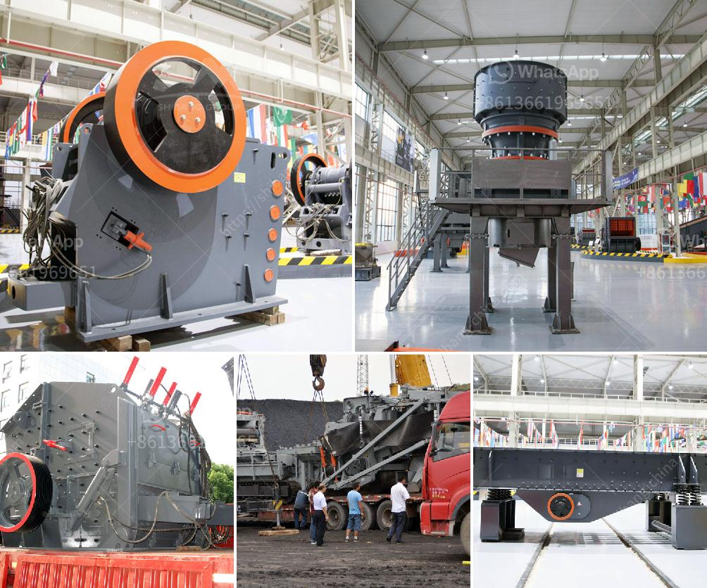

<h3>beneficiation small scale tin ore processing plant</h3>
Tin ore is one of the most valuable metal ore materials. It plays an important role in the development of modern society. Tin ore is used in many industries such as electronics, construction, materials, metallurgy, and chemical industries. With the rapid development of technology, high-quality and efficient tin ore processing equipment is increasingly in demand.

To maximize the value of tin ore and improve the economic benefits, tin ore beneficiation is essential. Tin ore beneficiation refers to the process of separating and upgrading tin minerals from tin ores. There are various beneficiation methods available, including gravity separation, flotation, and magnetic separation. Tin ore beneficiation plant aims to improve the grade or purity of tin ore concentrate and obtain tin metal from it.

Tin ore beneficiation plant equipment is commonly used for different ores beneficiation, including tin ore. In terms of tin ore beneficiation methods, the gravity separation method is appreciated for its high efficiency. Tin ore beneficiation equipment using gravity separation method is widely used in tin ore processing plant. These equipment include vibrating screening machine, gravity separation equipment, and magnetic separator.

Tin ore beneficiation plant also called tin ore processing plant is a tin smelting process diagram located in the area. Tin beneficiation plant features big crushing ratio, reliable operation, easy maintenance, and low operating cost. It is the new generation product designed and produced by Zenith, basing on our 30 year's mining production experience and the latest design conception.

The tin ore beneficiation plant also called tin ore concentration line or tin ore separator, in which spiral classifier design is adopted to separate the ore grains into fine particles. Tin ore processing plant is the best one of the plant for tin extraction. Ore dressing separator machine in China, offering Large Capacity Tin Beneficiation Plant, Tin Ore Beneficiation Equipment, Large Capacity Tin Beneficiation Plant, Tin Ore Beneficiation Equipment, High Quality Copper Ore Beneficiation Plant and so on.

In conclusion, beneficiation small-scale tin ore processing plant is essential for the development of small-scale mining enterprises. Tin ore beneficiation process can be divided into tin ore crushing, grinding, sizing, separating, concentrating. In each operation, you need different beneficiation equipment. For tin ore crushing, we can provide you with different kinds of crushing and grinding equipment, such as tin ore jaw crusher, cone crusher, impact crusher, ball mill, super thin grinding mill, etc. For tin ore separating, you can use our magnetic separator, flotation separator, or gravity separator. With the help of these machines, the beneficiation process will be successful and bring great benefits for small-scale mining enterprises.
<h3>Contact us</h3><ul><li><strong>Whatsapp:&nbsp;<a href="https://wa.me/8613661969651">+8613661969651</a></strong></li><li><a href="https://swt.shibang-china.com/?git&amp;zhl&amp;beneficiation small scale tin ore processing plant"><strong>Online Service(chat now)</strong></a></li></ul><h3>Related</h3><ul><li><a href='crushing equipment in south africa.md'>crushing equipment in south africa</a></li><li><a href='cobalt ore mining processing plant.md'>cobalt ore mining processing plant</a></li><li><a href='chromite ore flowsheet pdf.md'>chromite ore flowsheet pdf</a></li><li><a href='roller mill compontes.md'>roller mill compontes</a></li><li><a href='ceramic crusher machine.md'>ceramic crusher machine</a></li></ul>