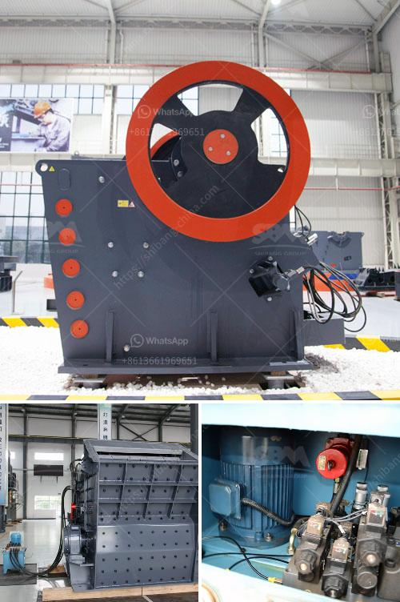

<h3>benefits of vsi crusher</h3>
VSI crusher, also known as vertical shaft impact crusher, is a highly efficient crushing machine widely used in the mining industry. It is a combination of various crushing principles and technologies, resulting in a high crushing efficiency. It provides reliable and energy-efficient crushing capabilities in various applications, making it a preferred choice for many industries. In this article, we will discuss the benefits of VSI crusher in detail.

First and foremost, VSI crusher offers significant cost savings over traditional crushing methods. With its high crushing efficiency and low energy consumption, it reduces the operating costs of the crushing process. Additionally, VSI crusher produces more cubical and even-shaped particles, which are desired for certain applications such as concrete production. This eliminates the need for further crushing stages, reducing both capital and operating costs.

Another major advantage of VSI crusher is its ability to produce a high-quality product with superior particle shape. Unlike cone crushers or jaw crushers, which typically produce flatter and elongated particles, VSI crusher generates excellent cubical particles. This is due to its unique rock-on-rock crushing mechanism, where the material is crushed by the impact of the rotor against the anvils. The resulting product is highly desirable for many industries, such as the construction and concrete industries.

VSI crusher also offers improved safety features in comparison to traditional crushing machines. The open-top metal rotor and the cascade feed system provide better visibility and access to the internals, making maintenance and inspection easier and safer. In addition, the VSI crusher is equipped with a hydraulic lifting system, allowing quick and convenient access to the rotor and wear parts for replacement, minimizing downtime and increasing productivity.

Furthermore, VSI crusher is an environmentally friendly solution for reducing the environmental impact of crushing operations. Its low energy consumption and efficient particle shaping properties result in reduced carbon emissions and a smaller ecological footprint. This aligns with the growing focus on sustainability and environmental responsibility in various industries.

VSI crusher also offers versatility in terms of the types of materials it can process. It can handle a wide range of materials, including hard and abrasive ones such as granite, basalt, and quartzite. This makes it suitable for various applications, from mining and construction to recycling and industrial minerals processing.

In conclusion, VSI crusher offers numerous benefits over traditional crushing methods. Its high crushing efficiency, low energy consumption, and superior particle shape result in significant cost savings and improved product quality. Its safety features and environmental friendliness further enhance its appeal for various industries. With its versatility and adaptability, VSI crusher proves to be an excellent choice for any crushing application.
<h3>Contact us</h3><ul><li><strong>Whatsapp:&nbsp;<a href="https://wa.me/8613661969651">+8613661969651</a></strong></li><li><a href="https://swt.shibang-china.com/?git&amp;zhl&amp;benefits of vsi crusher"><strong>Online Service(chat now)</strong></a></li></ul><h3>Related</h3><ul><li><a href='grinding of copper ores.md'>grinding of copper ores</a></li><li><a href='petroleum coke crushing plant.md'>petroleum coke crushing plant</a></li><li><a href='recycled crushed concrete 20mm.md'>recycled crushed concrete 20mm</a></li><li><a href='vertical mill cement.md'>vertical mill cement</a></li><li><a href='jaw crushers kyrgyzstan.md'>jaw crushers kyrgyzstan</a></li></ul>