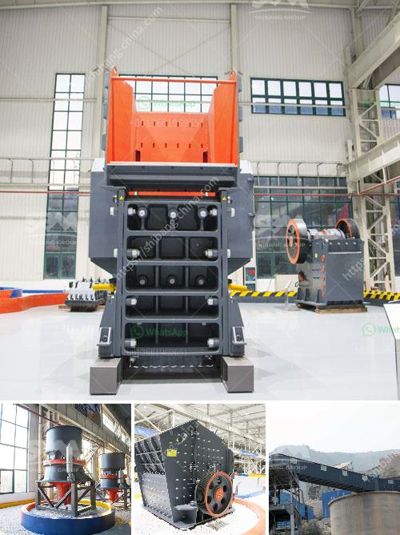

<h3>bentonite clay powder process equipment</h3>
Bentonite clay powder is a versatile and highly absorbent natural material that has been used for centuries for its numerous health and wellness benefits. From skin care to digestive health, bentonite clay powder is known for its ability to detoxify and cleanse the body. However, what many people may not be aware of is the extensive process that goes into producing this powerful clay powder.

The process of manufacturing bentonite clay powder involves several steps to ensure its quality and purity. First, the raw material, which is typically mined from natural deposits, is carefully selected and tested for its mineral content. This ensures that the clay has the necessary properties to effectively absorb toxins and impurities.

Once the raw material is obtained, it is then dried and finely ground into powder form. This grinding process is crucial in breaking down the clay particles to create a smooth and consistent texture. The fineness of the powder is also important, as it allows for better absorption and application.

After the grinding process, the bentonite clay powder undergoes a series of purification steps. This includes removing any impurities or contaminants that may have been present in the raw material. This purification process helps to ensure that the final product is of the highest quality and purity.

To further enhance the properties of bentonite clay powder, additional treatments may be applied. This can include activating the clay by exposing it to high temperatures or adding special additives to enhance its absorbent capacity. These additional treatments help to optimize the clay's ability to absorb toxins and provide maximum benefits to the user.

In conclusion, the process of manufacturing bentonite clay powder involves multiple steps to create a high-quality and potent product. From selecting the raw material to the grinding, purification, and additional treatments, each step is carefully executed to ensure the clay's effectiveness. So the next time you use bentonite clay powder for your health and wellness needs, remember the extensive process it went through to provide you with its remarkable benefits.
<h3>Contact us</h3><ul><li><strong>Whatsapp:&nbsp;<a href="https://wa.me/8613661969651">+8613661969651</a></strong></li><li><a href="https://swt.shibang-china.com/?git&amp;zhl&amp;bentonite clay powder process equipment"><strong>Online Service(chat now)</strong></a></li></ul><h3>Related</h3><ul><li><a href='mobile rock crushing plant nigeria.md'>mobile rock crushing plant nigeria</a></li><li><a href='alluvial diamond processing plant container for sale.md'>alluvial diamond processing plant container for sale</a></li><li><a href='cement processing plant.md'>cement processing plant</a></li><li><a href='diagram of a typical hammer mill.md'>diagram of a typical hammer mill</a></li><li><a href='small 100 ton rock crushing machine.md'>small 100 ton rock crushing machine</a></li></ul>