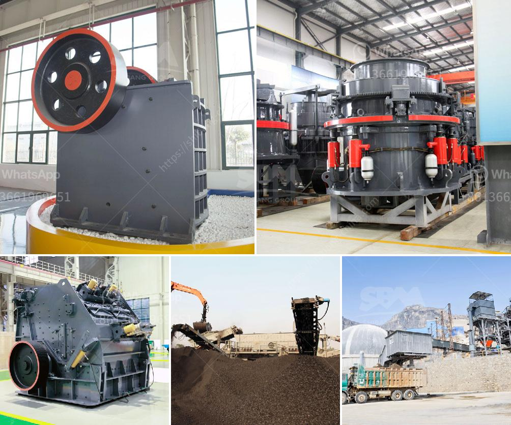

<h3>bentonite pulverizer</h3>
Bentonite is a clay mineral that is commonly used in various industries for its unique properties. It is known for its ability to absorb and remove impurities, making it an excellent choice for many applications. One of the most efficient ways to process bentonite is through the use of a bentonite pulverizer.

A bentonite pulverizer is a machine that is used to crush and grind bentonite stones into fine powder or micro powder. This process is essential in making drilling mud, casting sand, refractory materials, and ceramic glazes. Since bentonite is mixed with other materials to achieve its desired properties, pulverizing it ensures a consistent and homogeneous mixture.

The pulverization process involves a series of steps. Firstly, the bentonite stones are crushed into smaller particles using a machine. These crushed particles then pass through a vibrating screen to remove any impurities or oversized particles. The smaller particles are then fed into the pulverizer, where they are further ground into a fine powder.

The bentonite pulverizer is designed to maximize the grinding efficiency and reduce the overall energy consumption. It also ensures a uniform and consistent particle size distribution, which is crucial for achieving the desired properties in various applications. Therefore, using a bentonite pulverizer is a cost-effective and efficient way to process and utilize bentonite.

In addition to its use in various industries, bentonite also has several health benefits. It is known to promote detoxification and improve digestion by binding and removing toxins from the body. Bentonite clay masks are also popular in skincare for their ability to remove impurities and unclog pores.

In conclusion, a bentonite pulverizer is a valuable machine that is widely used in different industries. It plays a crucial role in processing bentonite into fine powder or micro powder for various applications. Its efficiency, cost-effectiveness, and ability to achieve a uniform particle size distribution make it an essential tool in harnessing the unique properties of bentonite. Whether it is for industrial purposes or personal care, the pulverization process enhances the usability and effectiveness of bentonite.
<h3>Contact us</h3><ul><li><strong>Whatsapp:&nbsp;<a href="https://wa.me/8613661969651">+8613661969651</a></strong></li><li><a href="https://swt.shibang-china.com/?git&amp;zhl&amp;bentonite pulverizer"><strong>Online Service(chat now)</strong></a></li></ul><h3>Related</h3><ul><li><a href='mineral processing ball mills nigeria.md'>mineral processing ball mills nigeria</a></li><li><a href='stone crusher capsule.md'>stone crusher capsule</a></li><li><a href='limestone powder making process.md'>limestone powder making process</a></li><li><a href='barite crushing machine from germany.md'>barite crushing machine from germany</a></li><li><a href='stone crushing equipment south africa.md'>stone crushing equipment south africa</a></li></ul>