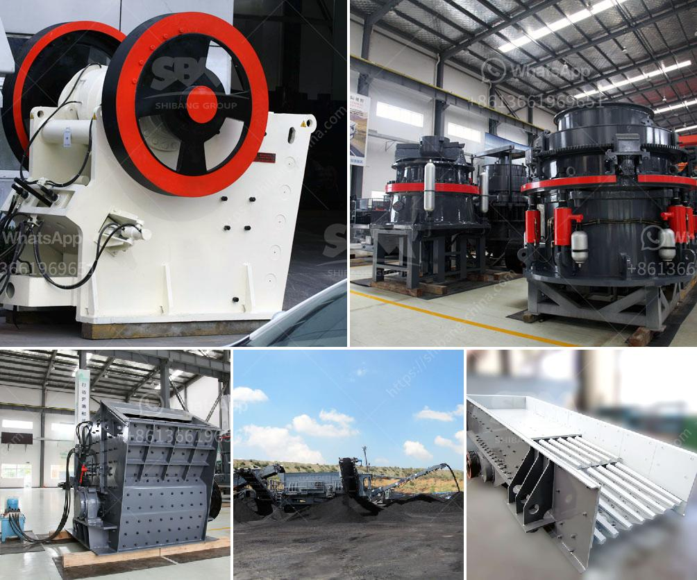

<h3>best china brand crushing plant</h3>
Title: Exploring the Best China Brand Crushing Plant: Efficient Solutions for Optimal Material Processing

In today's rapidly evolving industrial landscape, the demand for efficient and reliable crushing plants has never been greater. Excavation, construction, and mining industries rely heavily on crushing plants to process materials into valuable aggregates for various applications. When it comes to selecting the best crushing plant, China stands out as a leading manufacturer, offering a wide range of cutting-edge machinery designed to maximize efficiency and productivity. In this article, we will explore the top China brand crushing plant, highlighting their standout features and benefits.

YIFAN Machinery is one of the most reputable manufacturers of crushing plants in China, renowned for their commitment to technological advancements and superior performance. Their crushing plants are designed to tackle even the most demanding applications while maintaining exceptional efficiency. Equipped with advanced hydraulic systems, these plants ensure smooth and precise material processing. YIFAN Machinery's crushing plants boast robust construction and high durability, making them ideal for heavy-duty operations.

Shanghai Shibang Machinery Co., Ltd. (SBM) is another prominent China brand recognized for its high-quality crushing plants. SBM's crushing plant range offers maximum versatility and adaptability to different materials and processing requirements. Their advanced design features, such as adjustable counterattack plates and multi-level seal structures, contribute to enhanced efficiency and reduced downtime. SBM's crushing plants also prioritize user safety, incorporating intelligent protection systems.

Known for its innovative approach and exceptional quality standards, Zhengzhou Unique Industrial Equipment Co., Ltd. designs and manufactures state-of-the-art crushing plants that cater to varied material processing needs. Their crushing plants are distinguished by their compact and portable designs, facilitating easy transportation and installation. Zhengzhou Unique's plants are renowned for their high adaptability to different environments and materials, ensuring smooth and efficient crushing operations.

Renowned for its comprehensive range of crushing equipment, Luoyang Dahua Heavy Industry Science & Technology Co., Ltd., offers top-of-the-line crushing plants that excel in performance and reliability. Their crushing plants are equipped with advanced technology, such as PLC control systems and overload protection mechanisms, ensuring safe and efficient operations. Luoyang Dahua's crushing plants are specifically designed to handle a wide array of materials, including hard rocks and ores.

When it comes to selecting the best crushing plant for your material processing needs, Chinese brands offer exceptional solutions that prioritize efficiency, durability, and adaptability. YIFAN Machinery, Shanghai Shibang Machinery Co., Ltd., Zhengzhou Unique Industrial Equipment Co., Ltd., and Luoyang Dahua Heavy Industry Science & Technology Co., Ltd., are among the top China brands offering a wide range of crushing plants to meet diverse industry requirements. Regardless of the brand, it is crucial to assess individual project needs and consulting experts to select the best crushing plant that aligns with your specific applications, ensuring optimal material processing and overall operational success.
<h3>Contact us</h3><ul><li><strong>Whatsapp:&nbsp;<a href="https://wa.me/8613661969651">+8613661969651</a></strong></li><li><a href="https://swt.shibang-china.com/?git&amp;zhl&amp;best china brand crushing plant"><strong>Online Service(chat now)</strong></a></li></ul><h3>Related</h3><ul><li><a href='impact crushers manufacturers.md'>impact crushers manufacturers</a></li><li><a href='industrial roller ball mill.md'>industrial roller ball mill</a></li><li><a href='mill prices and for sale sri lanka.md'>mill prices and for sale sri lanka</a></li><li><a href='mobile stone crusher machine price.md'>mobile stone crusher machine price</a></li><li><a href='vibrating screen size 1mm.md'>vibrating screen size 1mm</a></li></ul>