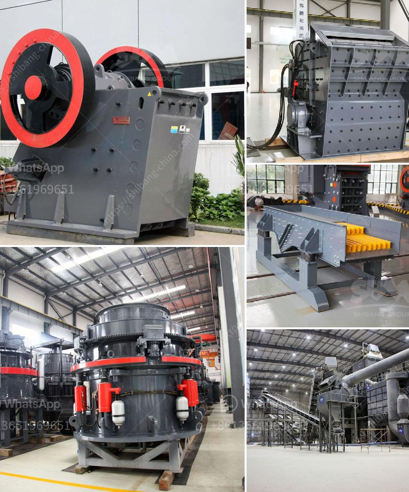

<h3>best portable jaw crusher granite</h3>
The demand for crushed granite has been steadily increasing in recent years due to its diverse applications in construction, landscaping, and infrastructure projects. As a result, the need for efficient and reliable crushing equipment has become paramount. When it comes to portable jaw crushers for granite, the options are limitless. Whether you are crushing hard rock or recycled materials, portable jaw crushers are an excellent option to consider.

One of the key advantages of a portable jaw crusher is its ability to suppress dust and noise levels, which greatly enhances its environmental credentials. Moreover, the mobility factor ensures that the crushing process can be carried out at the desired location, reducing transportation costs and time. This is especially valuable in remote areas where infrastructure might be limited.

When it comes to choosing the best portable jaw crusher for granite, there are several factors to consider. Firstly, it is crucial to assess the size of the granite rocks that will be processed. This will determine the size of the jaw crusher needed to effectively crush the material. Additionally, the processing capacity required should also be taken into account. Portable jaw crushers are available in a range of different sizes and capacities, allowing you to select the most suitable option for your specific needs.

In terms of performance, a robust and reliable portable jaw crusher is necessary to ensure efficient and effective crushing. Some key features to look out for include a sturdy construction, durable materials, and powerful crushing mechanisms. Additionally, it is advisable to choose a crusher that offers easy maintenance and accessibility for repairs.

Ultimately, the best portable jaw crusher for granite is one that combines all of these features and offers maximum efficiency. By investing in the right equipment, you can ensure that the crushing process is carried out smoothly, producing high-quality crushed granite for your various applications. Whether you are a contractor, landscaper, or involved in infrastructure projects, a portable jaw crusher is a valuable asset that can significantly enhance your operations and productivity.
<h3>Contact us</h3><ul><li><strong>Whatsapp:&nbsp;<a href="https://wa.me/8613661969651">+8613661969651</a></strong></li><li><a href="https://swt.shibang-china.com/?git&amp;zhl&amp;best portable jaw crusher granite"><strong>Online Service(chat now)</strong></a></li></ul><h3>Related</h3><ul><li><a href='primary crusher for sale.md'>primary crusher for sale</a></li><li><a href='ton hour coal crusher and screen.md'>ton hour coal crusher and screen</a></li><li><a href='crusher plant supplier in srilanka.md'>crusher plant supplier in srilanka</a></li><li><a href='cone crusher zenith.md'>cone crusher zenith</a></li><li><a href='mobile crushers japan.md'>mobile crushers japan</a></li></ul>