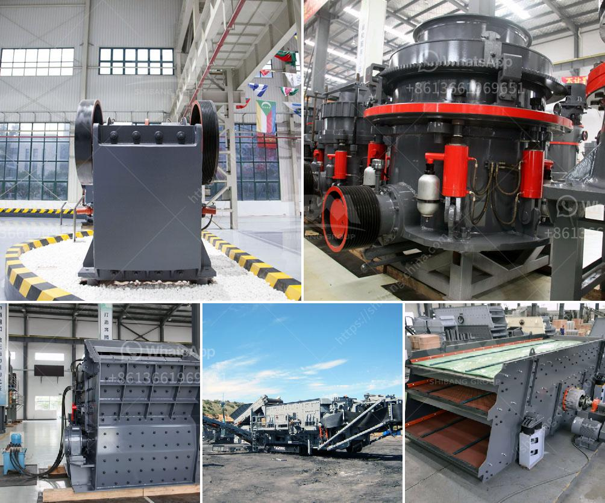

<h3>best quartz crushing machine india</h3>
Quartz is a mineral widely found in many geological formations around the world. It's a hard, crystalline mineral composed of silicon dioxide (SiO2) and is known for its durability and resistance to heat and chemicals. Quartz is commonly used in various industries, including construction, electronics, and jewelry making.

India is one of the leading producers and exporters of quartz in the world. The country has abundant reserves of this mineral, and its mining and processing industries have seen tremendous growth in recent years. With the increasing demand for quartz products, the need for efficient quartz crushing machines has also surged.

When it comes to quartz crushing machines in India, there are several options available in the market. However, not all machines are created equal, and it's essential to choose the right machine that matches your specific requirements.

One of the best quartz crushing machines in India is the Jaw Crusher. This machine is widely used in the mining industry and has the ability to crush quartz into small pieces. The jaw crusher consists of a fixed jaw plate and a moving jaw plate. When the feed material enters the crushing chamber, the moving jaw plate exerts a compressive force against the fixed jaw plate, resulting in the crushing of quartz particles.

Another popular quartz crushing machine is the Impact Crusher. This machine uses impact force to crush the quartz and is ideal for shaping the final product. The impact crusher has a high reduction ratio and can easily crush quartz into fine particles. It's also equipped with a screening system that allows for the separation of different-sized quartz particles.

For larger quartz crushing operations, the Cone Crusher is a perfect choice. This machine is designed to crush quartz into smaller pieces and has a high production capacity. The cone crusher uses a rotating cone to exert compression and crushing force on the quartz material. It's commonly used in the secondary and tertiary stages of quartz crushing.

In addition to these machines, there are also specialized quartz crushing machines available in India. For instance, the VSI Crusher, also known as the Vertical Shaft Impactor, is designed for shaping quartz particles and producing high-quality aggregates. This machine uses a high-speed rotor and anvils to crush quartz into desired shapes.

When choosing the best quartz crushing machine in India, it's important to consider factors such as your production requirements, cost-effectiveness, and desired final product. Additionally, be sure to check the machine's reliability, durability, and after-sales service.

In conclusion, India is a major player in the quartz industry, and the demand for efficient quartz crushing machines has increased significantly. With various options available, including jaw crushers, impact crushers, cone crushers, and specialized machines like VSI crushers, you can find the best quartz crushing machine in India that suits your needs and ensures high-quality production.
<h3>Contact us</h3><ul><li><strong>Whatsapp:&nbsp;<a href="https://wa.me/8613661969651">+8613661969651</a></strong></li><li><a href="https://swt.shibang-china.com/?git&amp;zhl&amp;best quartz crushing machine india"><strong>Online Service(chat now)</strong></a></li></ul><h3>Related</h3><ul><li><a href='buy gold crusher machine.md'>buy gold crusher machine</a></li><li><a href='dust pollution control machine for stone crusher.md'>dust pollution control machine for stone crusher</a></li><li><a href='hammer mill technical.md'>hammer mill technical</a></li><li><a href='stone crusher to diessel.md'>stone crusher to diessel</a></li><li><a href='gypsum plant unit and utilities.md'>gypsum plant unit and utilities</a></li></ul>