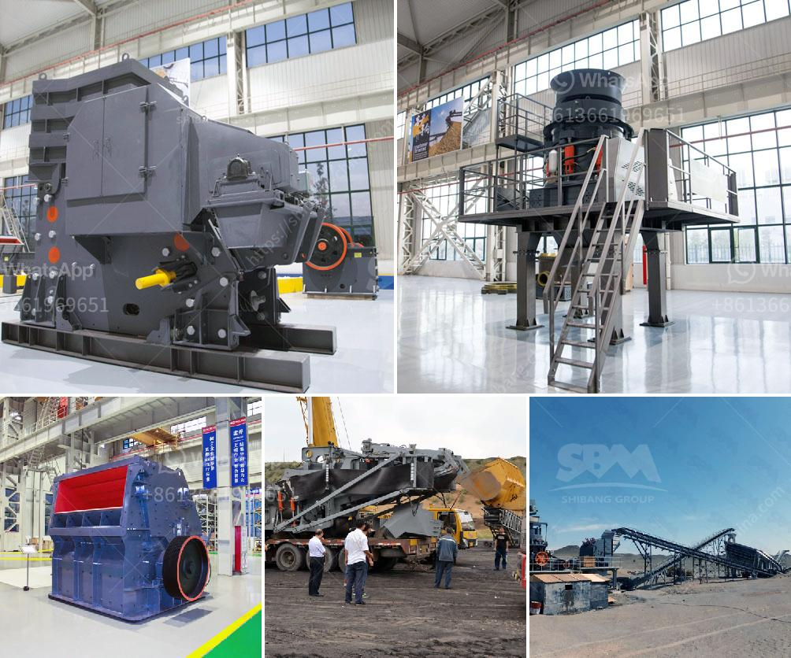

<h3>big stone quarry business plan pdf</h3>
The quarry business is a capital-intensive venture that requires substantial investment in the procurement of machinery, skilled labor, and resources. The success of the quarry business depends on the extraction, crushing, and screening of durable stones for various construction purposes. The quarry business is volatile and competitive, and requires a strategic plan to thrive and survive the challenges ahead.

To boost the chances of success, a well-detailed business plan is crucial. A quarry business plan outlines the objectives, financial projections, and strategies for achieving them. It serves as a roadmap for the quarry owners and helps identify the potential risks and challenges. The plan should include market research, competitor analysis, SWOT analysis, marketing strategies, and an operational plan.

Market research is essential for understanding the demand and supply dynamics of the quarry business. It helps identify the target market, analyze the competition, and determine the appropriate pricing strategies. Similarly, a competitor analysis sheds light on the strengths and weaknesses of existing players in the market, allowing businesses to position themselves effectively.

A SWOT analysis helps assess the internal strengths and weaknesses of the quarry business, as well as the external opportunities and threats. This analysis provides valuable insights that can be utilized to capitalize on opportunities, overcome weaknesses, mitigate threats, and build upon strengths.

Marketing strategies play a vital role in creating awareness, attracting customers, and generating revenue for the quarry business. This includes online and offline advertising, social media marketing, collaborations with contractors and suppliers, and building a strong brand image.

Finally, an operational plan outlines the day-to-day activities and processes required for the smooth functioning of the quarry business. This includes logistics, machinery maintenance, safety protocols, and efficient utilization of resources. It is important to invest in skilled labor and ensure their continuous training to maintain productivity.

In conclusion, a well-crafted business plan is essential for the success of a big stone quarry business. By conducting thorough market research, analyzing competition, assessing strengths and weaknesses, and implementing effective marketing and operational strategies, quarry owners can maximize their chances of profitability and growth.
<h3>Contact us</h3><ul><li><strong>Whatsapp:&nbsp;<a href="https://wa.me/8613661969651">+8613661969651</a></strong></li><li><a href="https://swt.shibang-china.com/?git&amp;zhl&amp;big stone quarry business plan pdf"><strong>Online Service(chat now)</strong></a></li></ul><h3>Related</h3><ul><li><a href='aggregate crusher plant price.md'>aggregate crusher plant price</a></li><li><a href='jaw crushers kyrgyzstan.md'>jaw crushers kyrgyzstan</a></li><li><a href='barite crusher machinery.md'>barite crusher machinery</a></li><li><a href='used quarry equipment for sale in calgary canada.md'>used quarry equipment for sale in calgary canada</a></li><li><a href='crusher plant suppliers in saudi arabia.md'>crusher plant suppliers in saudi arabia</a></li></ul>