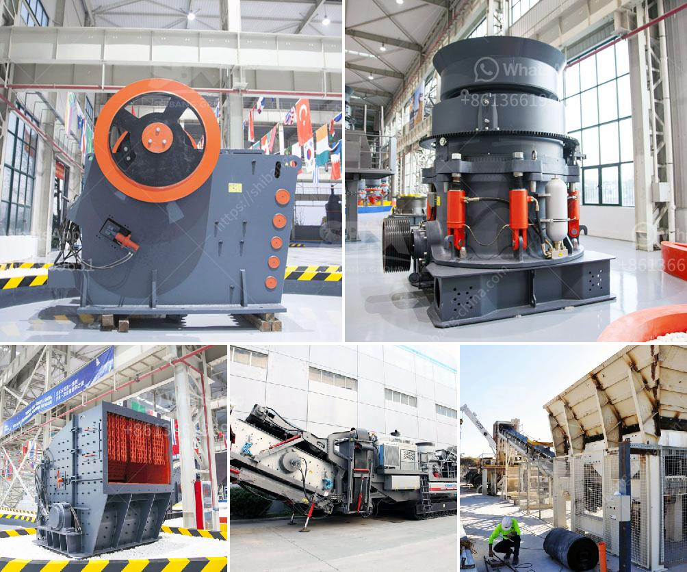

<h3>brushes for conveyor belts</h3>
Conveyor belts are a crucial component in several industries, ranging from manufacturing to mining. They allow for the seamless transportation of goods and materials, ensuring efficient production processes. However, over time, these conveyor belts can accumulate debris, dust, and other contaminants, leading to decreased performance and potential damage. This is where brushes for conveyor belts come into play, ensuring optimal belt cleanliness and significantly enhancing system efficiency and product quality.

One of the primary benefits of using brushes on conveyor belts is their ability to effectively clean off accumulated dirt and debris. The brushes, typically made from durable materials like nylon or polypropylene, gently scrub the belt's surface, dislodging any particles that may hinder its performance. This prevents the accumulation of debris, which can potentially cause blockages, system malfunctions, or increased wear and tear on the belt.

Not only do brushes keep the belts clean, but they also improve product quality. In industries where hygiene is crucial, such as food processing or pharmaceuticals, brushes help remove contaminants that could compromise the integrity of the final product. By eliminating particles such as dust, metal shavings, or product residuals, brushes ensure a cleaner transport surface, reducing the risk of contamination and improving product safety.

Additionally, using brushes on conveyor belts can minimize the need for manual cleaning and maintenance. Without brushes, belt cleaning would require shutting down the system and manually scrubbing the belt, leading to production downtime and increased labor costs. However, with brushes in place, the cleaning process occurs simultaneously with regular operation, eliminating the need for frequent shutdowns and reducing maintenance expenses.

It is worth noting that not all brushes are suitable for every conveyor belt application. Factors such as belt material, belt speed, and the type of residue or dirt being cleaned must be taken into consideration when selecting the appropriate brush. Some brushes are designed for light cleaning tasks, while others are specifically made for heavy-duty applications.

In conclusion, brushes for conveyor belts are invaluable tools that enhance system efficiency and improve product quality. By efficiently cleaning belts and preventing debris accumulation, brushes reduce the risk of system malfunctions and damage. Moreover, they contribute to maintaining cleanliness and enhancing safety in industries where product quality is paramount. Therefore, investing in the right brushes for a specific conveyor belt application is vital to ensure optimal system performance and productivity.
<h3>Contact us</h3><ul><li><strong>Whatsapp:&nbsp;<a href="https://wa.me/8613661969651">+8613661969651</a></strong></li><li><a href="https://swt.shibang-china.com/?git&amp;zhl&amp;brushes for conveyor belts"><strong>Online Service(chat now)</strong></a></li></ul><h3>Related</h3><ul><li><a href='ball mill for solutions.md'>ball mill for solutions</a></li><li><a href='crusher equipment supplier.md'>crusher equipment supplier</a></li><li><a href='used portable roller crushers and screens.md'>used portable roller crushers and screens</a></li><li><a href='manganese ore concentrate south africa.md'>manganese ore concentrate south africa</a></li><li><a href='bush crusher machine.md'>bush crusher machine</a></li></ul>