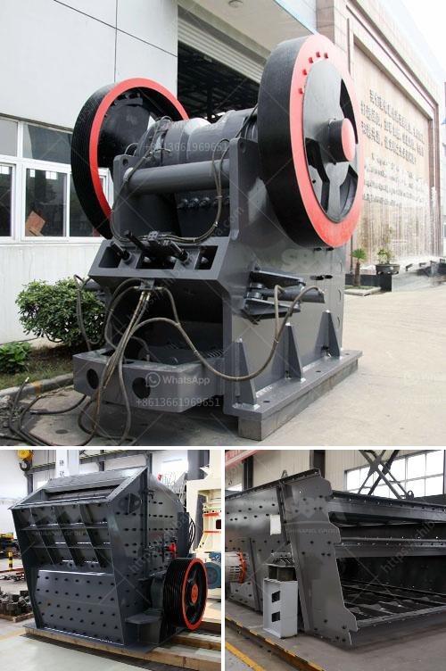

<h3>bush crusher machine</h3>
Bush crushing machines are an essential tool for gardeners and landscapers alike. These machines are specifically designed to break down and reduce large bushy plant material, making it easier to dispose of or use as compost. With their powerful motors and sharp blades, bush crushers are capable of swiftly processing even the thickest and most stubborn vegetation. In this article, we will explore the benefits and features of these efficient machines.

One of the primary advantages of using a bush crusher machine is the convenience it offers. Without this tool, gardeners would have to spend countless hours manually cutting and breaking down bushes, which can be time-consuming and physically exhausting. However, with a bush crusher machine, the work becomes effortless. By simply feeding the branches and leaves into the machine, it will quickly and efficiently transform them into smaller and more manageable pieces. This significantly cuts down the time and effort required to clear and maintain a garden or landscape.

Moreover, bush crusher machines help maintain cleanliness and tidiness in outdoor spaces. Untrimmed bushes and shrubs can quickly become unsightly and make a garden look messy. With a bush crusher, gardeners can easily maintain a clean and attractive appearance by effectively reducing the size and volume of vegetation. This makes it easier to gather and dispose of the plant material, promoting a well-kept and aesthetically pleasing outdoor environment.

Another important benefit of bush crushers is their ability to produce organic material for composting. By breaking down the plant material into smaller pieces, these machines facilitate faster decomposition, creating nutrient-rich compost that can be used to improve soil fertility. This is particularly beneficial for avid gardeners who value organic gardening practices and seek to enhance the quality of their soil naturally. Instead of purchasing compost from external sources, gardeners can rely on their bush crusher machine to produce their own high-quality compost.

When choosing a bush crusher machine, it is important to consider its specifications and features. Look for a machine with a powerful motor to ensure efficient performance. Ideally, the machine should have a large capacity and be able to handle various sizes of branches and leaves. Safety features such as emergency shut-off switches and automatic blade braking mechanisms are also important to prevent accidents and injuries.

In conclusion, bush crushers are invaluable tools for gardeners and landscapers. These machines significantly reduce the time and effort required for bush trimming and maintenance. With their ability to break down branches and leaves into smaller pieces, they make disposal or composting a breeze. Moreover, they contribute to maintaining clean and attractive outdoor spaces. For any avid gardener, a bush crusher machine is an investment that pays off in terms of convenience, efficiency, and overall garden aesthetics.
<h3>Contact us</h3><ul><li><strong>Whatsapp:&nbsp;<a href="https://wa.me/8613661969651">+8613661969651</a></strong></li><li><a href="https://swt.shibang-china.com/?git&amp;zhl&amp;bush crusher machine"><strong>Online Service(chat now)</strong></a></li></ul><h3>Related</h3><ul><li><a href='talcum powder bp usp manufacturers in india.md'>talcum powder bp usp manufacturers in india</a></li><li><a href='used jaw crushers from oman.md'>used jaw crushers from oman</a></li><li><a href='cost of small scale cement factory.md'>cost of small scale cement factory</a></li><li><a href='calcite micronizer machine manufacturer.md'>calcite micronizer machine manufacturer</a></li><li><a href='jaw crusher type sp 100 x.md'>jaw crusher type sp 100 x</a></li></ul>