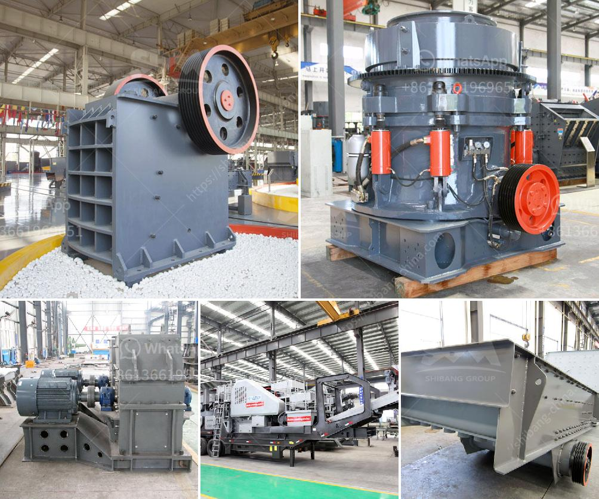

<h3>business plan for coal processing</h3>
The global demand for coal remains steady due to its vital role as an energy source. As nations aim to transition towards renewable energy, coal processing businesses have a pivotal role to play in ensuring efficient and sustainable coal utilization. This article outlines the key elements of a strong business plan for coal processing, aimed at maximizing profitability while minimizing environmental impact.

Before developing a business plan for coal processing, it is essential to understand the market dynamics and industry trends. Conducting a comprehensive industry analysis helps identify potential competitors and market gaps that your business can exploit. It is crucial to stay updated on regulatory requirements and evolving environmental standards to ensure compliance and anticipate market shifts.

Clearly define the products and services your coal processing business will offer. Apart from primary processing activities like cleaning, sorting, and grading coal, consider expanding your value proposition by including by-products such as coal ash for cement production or activated carbon for water treatment. This helps diversify revenue streams and reduce reliance solely on coal sales.

Develop a robust marketing and sales strategy to attract customers and gain a competitive edge in the market. Consider segmenting your target market based on industry, location, or size to tailor your offerings. Promote the environmental benefits of coal processing to appeal to customers seeking sustainable solutions. Engage in digital marketing initiatives, participate in industry conferences, and establish strategic partnerships to increase market visibility.

A successful coal processing business requires efficient and cost-effective operations. Outline the resources required, including equipment, raw materials, and labor. Consider investing in new technologies that enhance efficiency and reduce environmental impact, such as improved coal processing machinery or cleaner emissions systems. Ensure you have appropriate permits and licenses to operate legally and safely.

The financial aspect of your business plan needs careful consideration. Estimate startup costs, such as equipment purchases, facility rentals, and employee wages. Prepare detailed financial projections, including revenue forecasts, cash flow statements, and profit and loss statements. Evaluate potential sources of funding, such as bank loans or venture capital, and outline how you plan to repay these funds.

Identify potential risks and challenges in your business plan and develop effective mitigation strategies. Regulatory changes, fluctuating coal prices, and environmental uncertainties are just a few examples of risks to consider. Establish contingency plans and diversify your customer base to minimize the impact of unforeseen events. Implementing robust safety protocols is also essential to reduce workplace accidents and maintain employee wellbeing.

Given the environmental concerns associated with coal processing, emphasize the steps you will take to minimize your carbon footprint. Incorporate environmental management practices that prioritize cleaner emissions, water conservation, and waste reduction. In doing so, demonstrate your commitment to sustainable operations and differentiate your business in a rapidly evolving market.

A well-developed business plan is essential for the success of a coal processing venture. It enables entrepreneurs to identify market opportunities, set achievable goals, and navigate potential challenges. By ensuring efficient operations, embracing sustainability initiatives, and adapting to evolving industry trends, your coal processing business can thrive and contribute to a more sustainable future.
<h3>Contact us</h3><ul><li><strong>Whatsapp:&nbsp;<a href="https://wa.me/8613661969651">+8613661969651</a></strong></li><li><a href="https://swt.shibang-china.com/?git&amp;zhl&amp;business plan for coal processing"><strong>Online Service(chat now)</strong></a></li></ul><h3>Related</h3><ul><li><a href='business plan of silica sand crusher factory.md'>business plan of silica sand crusher factory</a></li><li><a href='activated carbon plant for sale.md'>activated carbon plant for sale</a></li><li><a href='mobile crushers japan.md'>mobile crushers japan</a></li><li><a href='mobile crushers for sale in south africa.md'>mobile crushers for sale in south africa</a></li><li><a href='calcium carbonate grinding plant feasibility.md'>calcium carbonate grinding plant feasibility</a></li></ul>