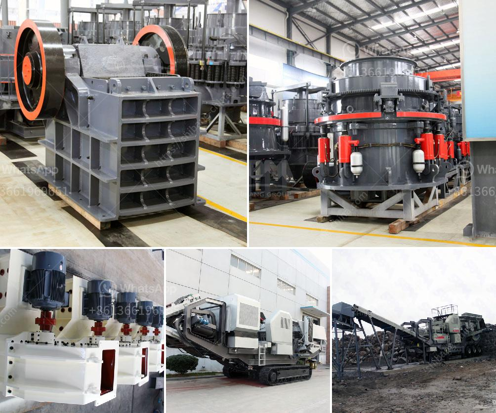

<h3>business plan for stone crushing in kenya</h3>
Starting a stone crushing business in Kenya is a great way to invest in the booming construction industry in the country. There are many factors to consider when investing in the stone crushing business. It mainly depends on your budget, location, and competition. Quality assurance plays a key role in this business.

An effective business plan will guide you in making the right decisions and securing finance from banks. The main objective of the business plan is to provide investors with useful information about the potential profitability of your stone crushing business. Typically, investors will look for a comprehensive business plan that covers all aspects of your project including the financial projections, market analysis, and management structure.

When creating your business plan, ensure that your financial projections are realistic and based on thorough market research. Kenya has a wide range of construction projects, especially in the development of new towns, roads, and buildings. This provides a ready market for quality stones and related products. However, you need to carefully consider the location of your stone crushing business.

Ideally, a centralized location will ensure fast and efficient distribution of the stones to construction sites. Additionally, consider the availability of raw materials, machinery, and labor when choosing the location. Access to a steady supply of quality stones is critical for the success of your business.

Your business plan should also include an analysis of your competition. Identify other stone crushing companies within your area and evaluate their business strategies. This will enable you to come up with unique selling points that will give you an edge over your competitors. Offer competitive prices and ensure that your product quality is consistent or even better than your competition.

In conclusion, starting a stone crushing business in Kenya is a profitable venture and it has been proven to be sustainable over the years. Ensure that you do thorough market research and make the right decisions when developing your business plan.
<h3>Contact us</h3><ul><li><strong>Whatsapp:&nbsp;<a href="https://wa.me/8613661969651">+8613661969651</a></strong></li><li><a href="https://swt.shibang-china.com/?git&amp;zhl&amp;business plan for stone crushing in kenya"><strong>Online Service(chat now)</strong></a></li></ul><h3>Related</h3><ul><li><a href='cost o gypsum processing machines.md'>cost o gypsum processing machines</a></li><li><a href='used vertical ball mill 200tph capacity.md'>used vertical ball mill 200tph capacity</a></li><li><a href='difference between milling and grinding.md'>difference between milling and grinding</a></li><li><a href='professional boulder crusher manufacturer.md'>professional boulder crusher manufacturer</a></li><li><a href='grinding mill for quartz in to 500 mesh in india.md'>grinding mill for quartz in to 500 mesh in india</a></li></ul>