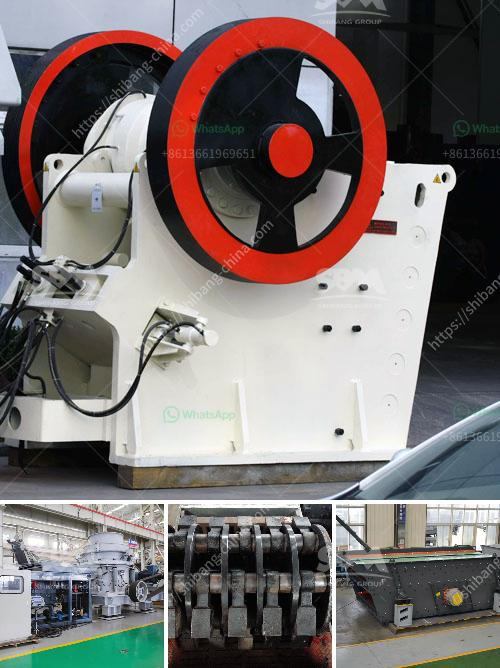

<h3>business plan of silica sand crusher factory</h3>
Silica sand is one of the most abundant resources on the earth's surface and is widely used in many industries, including construction, glass manufacturing, and oil and gas extraction. With growing demand and increasing applications, establishing a silica sand crusher factory can serve as a profitable and sustainable business opportunity.

The business plan for a silica sand crusher factory primarily revolves around the processes involved in the crushing, screening, and washing of silica sand. This requires a detailed analysis of the market demand for silica sand and the various applications it is used for. Understanding the demand and supply dynamics of the silica sand market will help determine the production capacity needed for the factory.

Another aspect of the business plan is the sourcing of raw materials. Silica sand can be obtained from various locations, including rivers, beaches, and quarries. Assessing the availability and quality of silica sand in close proximity to the factory is crucial for minimizing transportation costs and maintaining consistent quality.

Investing in high-quality crushing and screening equipment is essential for efficient silica sand processing. The business plan should include a detailed analysis of the required equipment and machinery, their cost, and their operational efficiency. Additionally, there should be a provision for regular maintenance and repairs to ensure uninterrupted production.

The business plan should also address the marketing and distribution strategy for the factory's silica sand products. Identifying potential customers and understanding their requirements and preferences will help in developing targeted marketing campaigns and effective distribution channels. Building strong relationships with construction companies, glass manufacturers, and oil and gas companies can ensure a steady demand for the silica sand produced by the factory.

Financial projections, including the initial investment, operational expenses, and potential revenue, need to be incorporated into the business plan. Calculating the return on investment, cash flow projections, and break-even points will provide a clear picture of the financial viability and sustainability of the silica sand crusher factory.

In conclusion, establishing a silica sand crusher factory can be a promising venture with potential for growth and profitability. A well-researched and comprehensive business plan, encompassing market analysis, sourcing of raw materials, equipment procurement, marketing strategy, and financial projections, will act as a roadmap for success in this industry.
<h3>Contact us</h3><ul><li><strong>Whatsapp:&nbsp;<a href="https://wa.me/8613661969651">+8613661969651</a></strong></li><li><a href="https://swt.shibang-china.com/?git&amp;zhl&amp;business plan of silica sand crusher factory"><strong>Online Service(chat now)</strong></a></li></ul><h3>Related</h3><ul><li><a href='used crushers sale usa.md'>used crushers sale usa</a></li><li><a href='gypsum board manufacturing machine.md'>gypsum board manufacturing machine</a></li><li><a href='second hand stone production line for.md'>second hand stone production line for</a></li><li><a href='granite and basalt crushing line ton per day.md'>granite and basalt crushing line ton per day</a></li><li><a href='ball mills for clay.md'>ball mills for clay</a></li></ul>