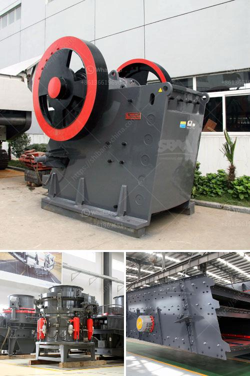

<h3>business proposal sample for gold milling</h3>
The gold milling business has tremendous potential in today's global market. With the ever-increasing demand for gold and precious metals, the milling process enhances the extraction of gold from ore and produces high-quality refined gold products. This article presents a comprehensive business proposal sample for entrepreneurs looking to venture into the gold milling industry.

The proposed business aims to establish a state-of-the-art gold milling facility to process various grades of gold ore. Our milling facility will utilize advanced technology and skilled professionals to ensure efficient and cost-effective gold extraction and refinement processes.

The global gold market has been witnessing steady growth due to the rising demand for gold jewelry, investments, and industrial applications. Our business proposal targets this lucrative market by offering gold milling services that cater to various industry demands. Market research indicates a steady supply of raw gold ores, ensuring a steady source of revenue for the gold milling business.

Our business model is based on establishing a fully equipped and modernized gold milling facility. We will acquire raw gold ore from local mines or through partnerships with mining companies. The processing and refinement process will take place under strict quality control measures to ensure a superior end product. Our business will generate revenue through gold sales, refining fees, and ancillary services such as assay testing.

The gold milling facility will be located strategically near our partner mines, minimizing transportation costs and ensuring a continuous supply chain. We will invest in state-of-the-art milling machinery and employ experienced professionals to oversee operations. To supplement our core milling services, we will offer value-added services such as gold storage, transportation, and assay testing to create additional revenue streams.

Based on extensive market research, we have prepared financial projections that demonstrate the potential profitability of this venture. The projections include initial setup costs, operational expenses, expected revenue streams, and projected profits. We will also present a comprehensive risk assessment, highlighting potential challenges and mitigation strategies.

The gold milling industry offers tremendous growth potential, driven by the increasing global demand for gold. Our business proposal sample provides a blueprint for entrepreneurs wishing to enter this lucrative sector. By following a comprehensive business model, investing in modern technology, and adhering to strict quality control measures, success in the gold milling industry is within reach. With a well-planned financial strategy, a cohesive team, and a commitment to excellence, we are confident in the future success of our gold milling business.
<h3>Contact us</h3><ul><li><strong>Whatsapp:&nbsp;<a href="https://wa.me/8613661969651">+8613661969651</a></strong></li><li><a href="https://swt.shibang-china.com/?git&amp;zhl&amp;business proposal sample for gold milling"><strong>Online Service(chat now)</strong></a></li></ul><h3>Related</h3><ul><li><a href='wet ultra fine fine grinding equipment.md'>wet ultra fine fine grinding equipment</a></li><li><a href='cobalt ore mining processing plant.md'>cobalt ore mining processing plant</a></li><li><a href='iron crushing plant in mexico.md'>iron crushing plant in mexico</a></li><li><a href='all quarries crushing plants.md'>all quarries crushing plants</a></li><li><a href='cone crusher for sale nigeria.md'>cone crusher for sale nigeria</a></li></ul>