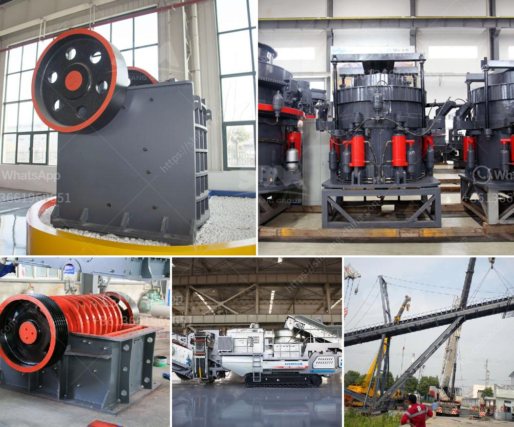

<h3>buy fully gold mining wash plant</h3>
Investing in a fully functional gold mining wash plant can bring significant returns for both individual prospectors and large mining companies. These efficient machines are designed to extract gold particles from the soil and separate them from other materials, providing an optimal yield. In this article, we will delve into the benefits of purchasing a gold mining wash plant and explore some features to consider.

A gold mining wash plant is an innovative and highly effective tool that helps retrieve gold from soil, sand, and rocks. It operates on the principle of gravity separation, creating a concentration of gold particles by exploiting their different specific gravities. The plant typically consists of a feeder hopper, primary and secondary screen decks, sluice box, vibrating screen, and shaking table. These components work in harmony to maximize gold recovery.

One of the main advantages of a gold mining wash plant is its efficiency. Unlike traditional methods, such as panning or using a sluice box, which require a lot of manual labor, a wash plant automates the process. This results in significantly higher productivity, allowing more material to be processed in a shorter period. By utilizing modern technologies and machinery, it reduces the time and effort required to extract gold.

Furthermore, gold mining wash plants are highly versatile and can be used in various environments. Whether you are prospecting in a river, stream, or even in arid regions, these plants can adapt to different conditions. In addition, they can handle different types of soil and rocks, as long as there is an indication of gold particles present. This flexibility makes the wash plant a valuable asset for prospectors exploring different mining areas.

The capacity of a gold mining wash plant is another crucial aspect to consider. A plant with a higher capacity will enable you to process larger amounts of material, increasing your chances of finding substantial gold deposits. Depending on your requirements, there are wash plants available with capacities ranging from 50 tons per hour to several hundred tons per hour. Understanding the scale of your operation and your production goals will help determine the appropriate capacity.

When purchasing a gold mining wash plant, it is essential to choose a reputable manufacturer or supplier. Look for companies with a proven track record in designing and producing reliable equipment. Additionally, ensure that the plant is constructed using high-quality materials and components. A sturdy and durable wash plant will withstand the harsh conditions of mining operations and provide long-term value.

In conclusion, investing in a fully functional gold mining wash plant can yield significant returns for prospectors and mining companies. These efficient machines automate the gold extraction process, resulting in higher productivity and reduced manual labor. They are versatile, adaptable to various mining environments, and can handle different soil and rock types. The capacity of the plant should align with your production goals. Lastly, choosing a reputable manufacturer and a well-built plant ensures reliability and longevity. By making an informed purchase, you can enhance your chances of success in the gold mining industry.
<h3>Contact us</h3><ul><li><strong>Whatsapp:&nbsp;<a href="https://wa.me/8613661969651">+8613661969651</a></strong></li><li><a href="https://swt.shibang-china.com/?git&amp;zhl&amp;buy fully gold mining wash plant"><strong>Online Service(chat now)</strong></a></li></ul><h3>Related</h3><ul><li><a href='price of raymond used for crushing the powder stones.md'>price of raymond used for crushing the powder stones</a></li><li><a href='mobile stone crushers.md'>mobile stone crushers</a></li><li><a href='fastest gold hammer mill in china.md'>fastest gold hammer mill in china</a></li><li><a href='marble quarry business plan.md'>marble quarry business plan</a></li><li><a href='stone crushing machine manufacturers.md'>stone crushing machine manufacturers</a></li></ul>