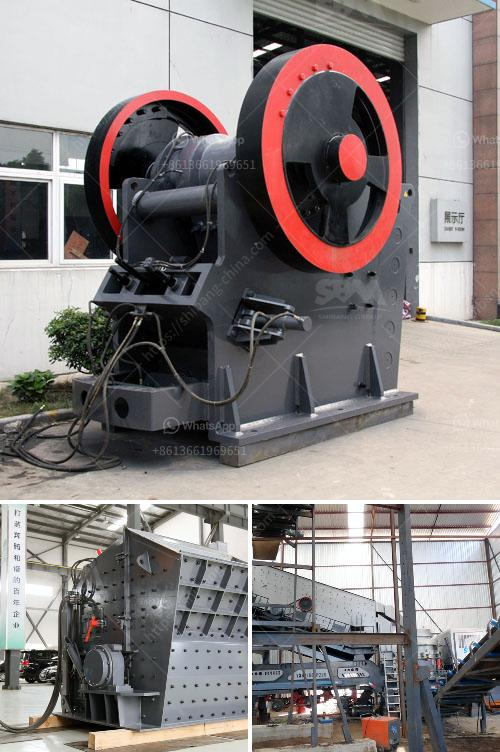

<h3>buy gold crusher machine</h3>
If you are interested in investing in gold and want to start small, a gold crusher machine is the perfect tool for you. Gold is one of the most valuable metals and has been sought after for centuries. With the rise in gold prices, investing in this metal can be highly profitable. Whether you are a novice or an experienced investor, a gold crusher machine can help you extract gold ore and turn it into a valuable asset.

A gold crusher machine is a machine that is designed to crush large rocks into smaller pieces, making it easier for the gold to be extracted from the ore. These machines have been used by prospectors, as well as small-scale miners, to crush gold ore. However, this is not the only way to invest in gold. There are various other methods such as buying gold coins or bullion, ETFs, or even investing in gold mining stocks. So, why should you consider buying a gold crusher machine?

Firstly, a gold crusher machine allows you to turn gold ore into gold nuggets, which can be easily sold or stored as a long-term investment. By using a crusher machine, you can extract gold from rocks that normally would not yield any gold. This can greatly increase your chances of finding valuable gold deposits and increase your overall profits.

Secondly, a gold crusher machine is portable and can be easily transported to different mining sites. This mobility allows you to take advantage of different gold-rich areas and explore different locations. By having a portable gold crusher machine, you can maximize your chances of finding large amounts of gold.

Furthermore, a gold crusher machine is easy to use and requires minimal expertise. Most machines come with detailed instructions, making it easy for anyone to operate them. This means that you do not need to have extensive knowledge or experience in mining to use a gold crusher machine. It is a beginner-friendly tool that can help you get started in the world of gold mining.

Lastly, a gold crusher machine is a cost-effective investment. Compared to other methods of acquiring gold, such as buying gold coins or bullion, a crusher machine is a more affordable option. This makes it ideal for those who want to start small or have a limited budget. Additionally, the machine can pay for itself in a relatively short amount of time if you are able to extract a substantial amount of gold.

In conclusion, a gold crusher machine is a valuable asset for anyone looking to invest in gold. It allows you to extract gold from rocks and turn it into a profitable investment. With its portability, ease of use, and cost-effectiveness, a gold crusher machine is a viable option for both novice and experienced investors. So, if you are interested in investing in gold, consider purchasing a gold crusher machine and start your journey to financial success.
<h3>Contact us</h3><ul><li><strong>Whatsapp:&nbsp;<a href="https://wa.me/8613661969651">+8613661969651</a></strong></li><li><a href="https://swt.shibang-china.com/?git&amp;zhl&amp;buy gold crusher machine"><strong>Online Service(chat now)</strong></a></li></ul><h3>Related</h3><ul><li><a href='prices for granite crushers.md'>prices for granite crushers</a></li><li><a href='grinding machine for calciun carbinate from germany.md'>grinding machine for calciun carbinate from germany</a></li><li><a href='19mm crusher stone philippines quarry.md'>19mm crusher stone philippines quarry</a></li><li><a href='manufacturing process of cement.md'>manufacturing process of cement</a></li><li><a href='process of crushing granite.md'>process of crushing granite</a></li></ul>