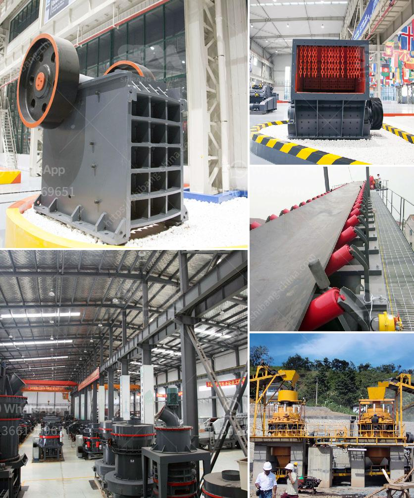

<h3>buy quarry crusher machine from turkey</h3>
The increasing demand for construction materials has led to a rise in the quarrying industry. Quarrying involves the extraction of valuable rocks or minerals from the earth's surface. It is essential to have the appropriate equipment for this process, which is where quarry crusher machines come into play. Quarry crusher machines are used to crush stones and ores into smaller-sized particles for further processing. Turkey is known for its extensive natural stone resources, making it a popular destination for quarrying activities. This article will explore the benefits of buying quarry crusher machines from Turkey.

One of the primary advantages of purchasing quarry crusher machines from Turkey is the abundance of high-quality natural stone resources. Turkey has a rich geological structure, housing a wide variety of valuable rocks and minerals. The country's stones are renowned for their durability, elegance, and versatility. Marbles, granites, limestones, and more are found in abundance in Turkey, making it an ideal location for quarrying activities. By purchasing crusher machines from Turkey, buyers can tap into this vast resource pool and have access to superior-quality stones.

Additionally, the Turkish quarrying industry has a long history and expertise in stone extraction. The country has been involved in quarrying activities for centuries and has perfected the process of extracting, processing, and distributing natural stones. Turkish quarrying companies have invested heavily in modern machinery and technology to ensure efficient and sustainable quarry operations. By buying quarry crusher machines from Turkey, customers can benefit from this accumulated knowledge and expertise, leading to improved productivity and profitability.

Moreover, Turkish quarry crusher machine manufacturers are renowned for their customer-centric approach and excellent after-sales support. The manufacturers prioritize customer satisfaction and ensure that their products meet the highest standards of quality and reliability. They provide comprehensive customer support, including installation, training, and maintenance services. By purchasing from Turkish manufacturers, customers can have peace of mind knowing that they will receive ongoing support and assistance throughout the lifespan of their crusher machines.

Furthermore, buying quarry crusher machines from Turkey can lead to cost savings. Turkish manufacturers offer competitive prices due to the country's lower labor and operational costs compared to other manufacturing hubs. The cost-effectiveness of Turkish crusher machines does not compromise the quality, as the manufacturers adhere to international standards and use advanced technologies. Customers can enjoy the benefits of cost savings without compromising on the performance and durability of the machines.

In conclusion, Turkey is an ideal source for quarry crusher machines due to its abundant natural stone resources, expertise in quarrying activities, customer-centric approach, and cost-effectiveness. By purchasing from Turkish manufacturers, customers can access high-quality stones, benefit from extensive support services, and save on costs. Whether for construction projects or decorative purposes, quarry crusher machines from Turkey are a reliable and efficient solution for the extraction and processing of natural stones.
<h3>Contact us</h3><ul><li><strong>Whatsapp:&nbsp;<a href="https://wa.me/8613661969651">+8613661969651</a></strong></li><li><a href="https://swt.shibang-china.com/?git&amp;zhl&amp;buy quarry crusher machine from turkey"><strong>Online Service(chat now)</strong></a></li></ul><h3>Related</h3><ul><li><a href='cobble crusher supplier.md'>cobble crusher supplier</a></li><li><a href='list of crusher in bharatpur distric.md'>list of crusher in bharatpur distric</a></li><li><a href='stone for stone mill.md'>stone for stone mill</a></li><li><a href='hgm micro powder grinding mill.md'>hgm micro powder grinding mill</a></li><li><a href='feldspar grinding plant.md'>feldspar grinding plant</a></li></ul>