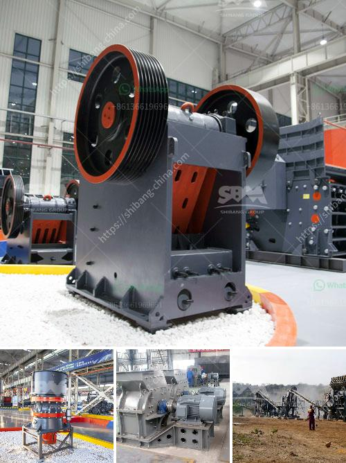

<h3>calcite micronizer machine manufacturer</h3>
Calcite is a mineral with a wide range of uses. It is commonly found in limestone and marble and is the primary constituent of shells and pearls. With its unique characteristics, calcite is highly sought after in various industries, including construction, plastics, ceramics, and agriculture, among others. To harness the benefits of calcite, manufacturers rely on advanced machinery and equipment, such as the calcite micronizer machine.

A calcite micronizer machine is designed to grind calcite into fine particles or powders. This process involves using high-speed rotation and motion to reduce the calcite into smaller sizes, allowing for better dispersion and utilization in different applications. These machines are commonly used in industries that require precise grinding, such as the pharmaceutical, food, and chemical sectors.

One prominent manufacturer in the field of calcite micronizer machines is committed to delivering high-quality equipment to its customers. With its extensive experience and expertise, the company ensures precision grinding solutions that meet the specific requirements of various industries.

The calcite micronizer machine manufacturer utilizes cutting-edge technology to design and develop efficient machines. Advanced features such as variable speed control, adjustable grinding chamber, and automatic particle size control ensure superior performance and consistent results. These machines can achieve high production rates while maintaining the desired particle size distribution, leading to enhanced product quality and increased profitability for the end users.

Moreover, the manufacturer focuses on the quality and durability of its machines. Heavy-duty construction materials, such as stainless steel and alloy steels, are used to ensure longevity and resistance to wear and tear. This enables the machines to withstand continuous use in demanding industrial environments, resulting in reduced maintenance costs and enhanced operational durability.

In addition to manufacturing robust machines, the company also provides comprehensive after-sales support. This includes installation and commissioning services, operator training, and technical assistance. Prompt customer service and efficient spare parts availability ensure minimal downtime and uninterrupted production for the end users.

Furthermore, the manufacturer emphasizes innovation and continuous improvement. With a dedicated research and development team, the company strives to enhance its machines' performance and efficiency continually. This includes incorporating new technologies, improving energy efficiency, and exploring eco-friendly solutions. By staying at the forefront of technological advancements, the calcite micronizer machine manufacturer aims to meet the evolving needs and challenges of its customers.

The calcite micronizer machine manufacturer adheres to strict quality standards and certifications. This ensures that the machines meet international regulations and industry requirements. Compliance with safety guidelines, such as the CE and ISO certifications, guarantees the reliability and safety of the machines, providing peace of mind to the end users.

In conclusion, the calcite micronizer machine manufacturer offers precision grinding solutions through its advanced machinery. Through continuous innovation, focus on quality, and comprehensive after-sales support, the manufacturer ensures customer satisfaction and long-term success. By investing in a calcite micronizer machine, industries can unlock the full potential of calcite, harness its versatile characteristics, and reap the benefits in their respective applications.
<h3>Contact us</h3><ul><li><strong>Whatsapp:&nbsp;<a href="https://wa.me/8613661969651">+8613661969651</a></strong></li><li><a href="https://swt.shibang-china.com/?git&amp;zhl&amp;calcite micronizer machine manufacturer"><strong>Online Service(chat now)</strong></a></li></ul><h3>Related</h3><ul><li><a href='m sand crusher in tirunelveli.md'>m sand crusher in tirunelveli</a></li><li><a href='china clay processing plant.md'>china clay processing plant</a></li><li><a href='mica powder manufacturing process.md'>mica powder manufacturing process</a></li><li><a href='machinery for manufacturing of artificial granite.md'>machinery for manufacturing of artificial granite</a></li><li><a href='alluvial wash plants in south africa.md'>alluvial wash plants in south africa</a></li></ul>