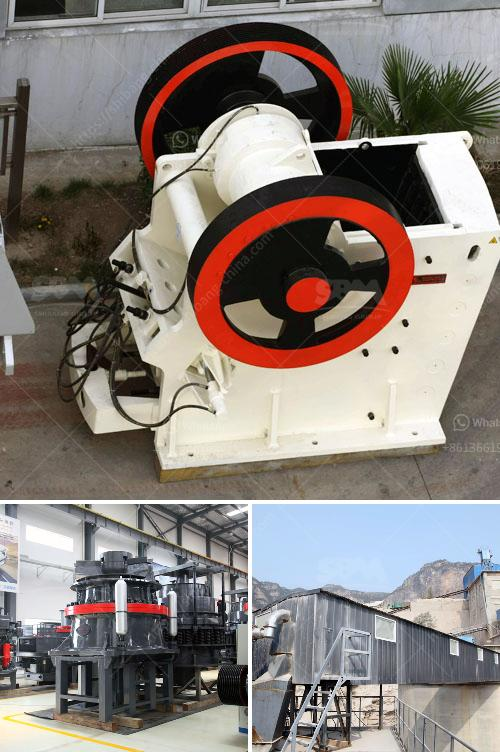

<h3>calcium carbonate grinding plant feasibility</h3>
The increasing demand for calcium carbonate powder in various industries has led to the establishment of calcium carbonate grinding plants around the world. It is a lucrative business opportunity, as calcium carbonate is one of the most widely used industrial minerals. However, before setting up a calcium carbonate grinding plant, it is essential to assess its feasibility.

The feasibility of a calcium carbonate grinding plant depends on several factors, including the following.

1. Market demand: The first step in evaluating the feasibility of a calcium carbonate grinding plant is to assess the market demand. Understand the current market dynamics, including the growth rate, potential customers, and key applications. Calcium carbonate is used in many industries such as paper, plastics, paints, coatings, and rubber. Analyzing the market demand will help determine the viability of a grinding plant.

2. Raw material availability: Calcium carbonate is commonly obtained from limestone, marble, or chalk. Assess the availability and quality of these raw materials in the proposed location. It is crucial to ensure a sustainable and reliable supply of high-quality raw materials for the grinding plant.

3. Production capacity: Determine the production capacity required to meet the market demand. Consider the projected growth rate of the industry, potential customers, and the scale of operations. The production capacity should be optimal to maximize efficiency and profitability of the grinding plant.

4. Machinery and equipment: Evaluate the required machinery and equipment for the grinding plant. The main equipment usually includes crushers, mills, classifiers, dust collectors, and packaging machines. Assess the availability, cost, and quality of these machinery and equipment to ensure smooth operations and product quality.

5. Site selection: Choose an appropriate site for the grinding plant. Consider factors such as proximity to raw material sources, transportation infrastructure, utility availability, and environmental regulations. The site should provide easy access to raw materials and facilitate efficient distribution of finished products.

6. Environmental impact: Assess the environmental impact of the grinding plant and comply with local regulations. Calcium carbonate grinding generates dust and noise pollution, so it is important to implement appropriate mitigation measures to minimize environmental impact.

7. Financial viability: Conduct a comprehensive financial analysis to determine the feasibility of the grinding plant. Evaluate capital expenditure, operational costs, revenue projections, and return on investment. It is crucial to ensure that the project can generate sufficient revenue to cover costs and provide a reasonable rate of return.

In conclusion, establishing a calcium carbonate grinding plant requires a thorough feasibility assessment. Factors such as market demand, raw material availability, production capacity, machinery and equipment, site selection, environmental impact, and financial viability should be thoroughly evaluated. A well-planned and executed grinding plant can provide significant opportunities for entrepreneurs in the minerals processing industry.
<h3>Contact us</h3><ul><li><strong>Whatsapp:&nbsp;<a href="https://wa.me/8613661969651">+8613661969651</a></strong></li><li><a href="https://swt.shibang-china.com/?git&amp;zhl&amp;calcium carbonate grinding plant feasibility"><strong>Online Service(chat now)</strong></a></li></ul><h3>Related</h3><ul><li><a href='stone crushing equipment south africa.md'>stone crushing equipment south africa</a></li><li><a href='safety poster for coal handling plant.md'>safety poster for coal handling plant</a></li><li><a href='jaw crusher 24x12 price.md'>jaw crusher 24x12 price</a></li><li><a href='graphite mining equipment.md'>graphite mining equipment</a></li><li><a href='prices of stone crushers in philippines.md'>prices of stone crushers in philippines</a></li></ul>